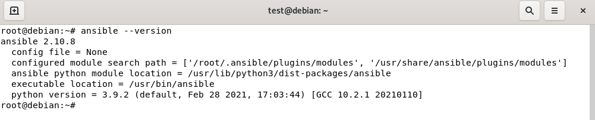
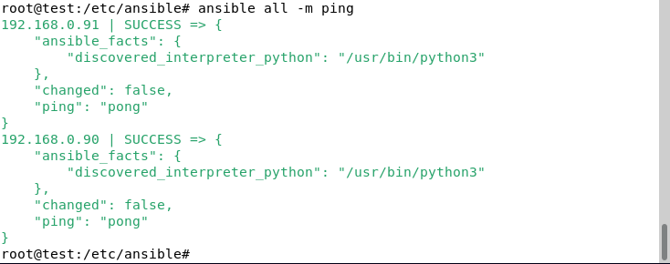
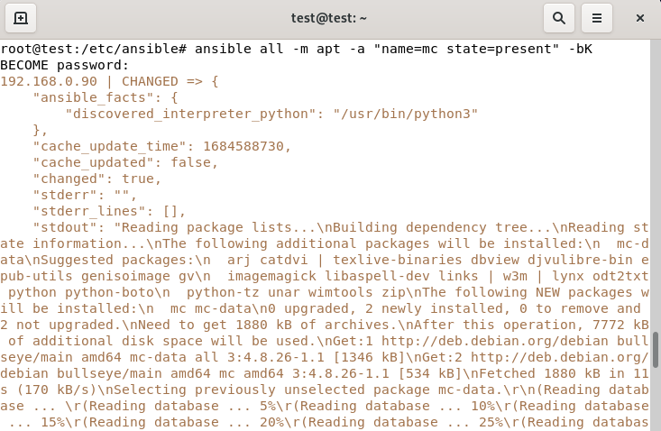
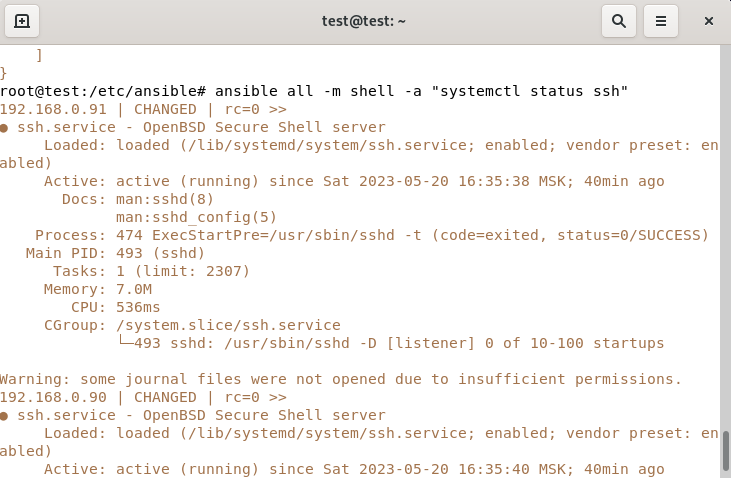
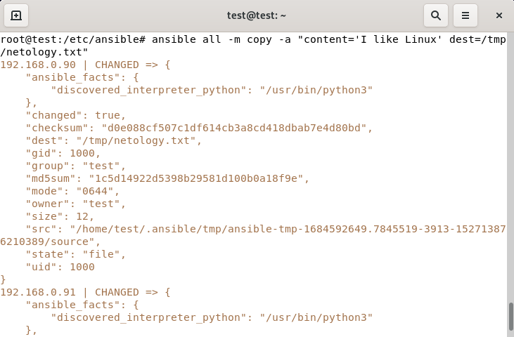

# Домашнее задание к занятию «Ansible. Часть 1»

### Оформление домашнего задания

1.  Домашнее задание выполните в [Google Docs](https://docs.google.com/) и отправьте на проверку ссылку на ваш документ в личном кабинете.
2.  В названии файла укажите номер лекции и фамилию студента. Пример названия: 7.1. Ansible. Часть 1 — Александр Александров.
3.  Перед отправкой проверьте, что доступ для просмотра открыт всем, у кого есть ссылка. Если нужно прикрепить дополнительные ссылки, добавьте их в свой Google Docs.

Любые вопросы по решению задач задавайте в чате учебной группы.

---

### Задание 1

**Ответьте на вопрос в свободной форме.**

Какие преимущества даёт подход IAC?

Ответ: Скорость, уменьшает риски возникновения ошибок, маштабируемость.

---

### Задание 2

**Выполните действия и приложите скриншоты действий.**

1.  Установите Ansible.
2.  Настройте управляемые виртуальные машины, не меньше двух.
3.  Создайте файл inventory. Предлагается использовать файл, размещённый в папке с проектом, а не файл inventory по умолчанию.
4.  Проверьте доступность хостов с помощью модуля ping.

Ответ:

---

### Задание 3

**Ответьте на вопрос в свободной форме.**

Какая разница между параметрами forks и serial?

Ответ: forks управляет количеством одновременно выполненных задач на одном хосте, а параметр serial управляет количеством хостов, для которых одновременно выполняется задача.

---

### Задание 4

В этом задании вы будете работать с Ad-hoc коммандами.

**Выполните действия и приложите скриншоты запуска команд.**

1.  Установите на управляемых хостах любой пакет, которого нет.
2.  Проверьте статус любого, присутствующего на управляемой машине, сервиса.
3.  Создайте файл с содержимым «I like Linux» по пути /tmp/netology.txt.

Ответ:

