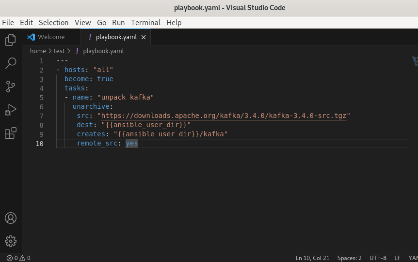
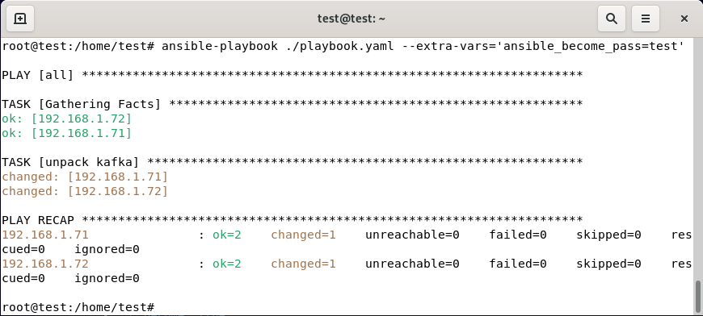
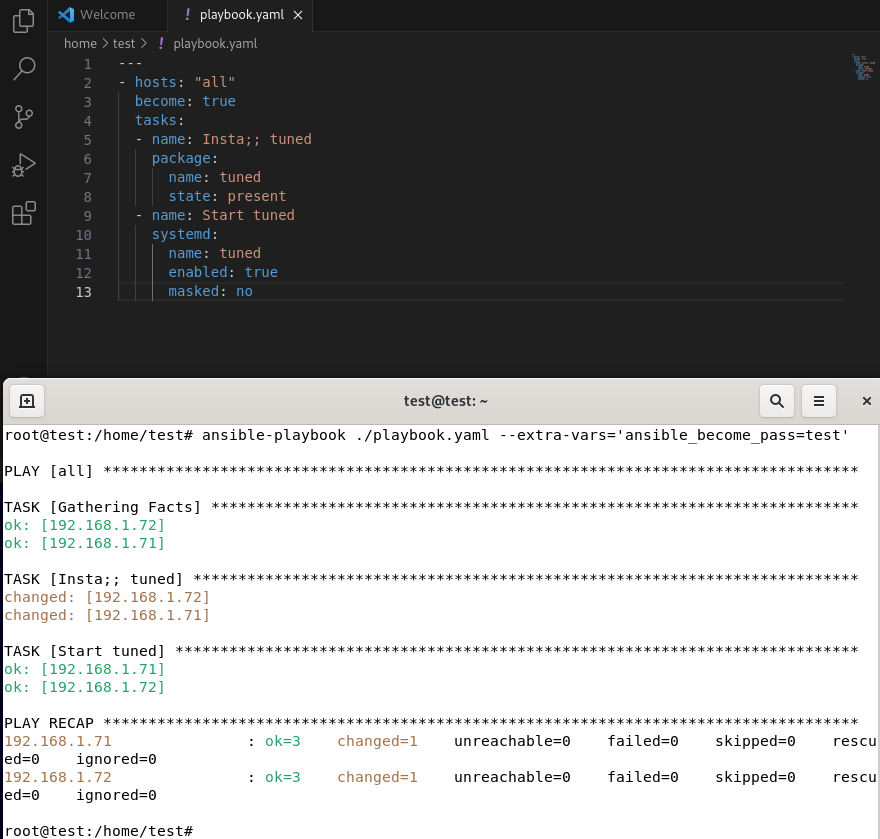
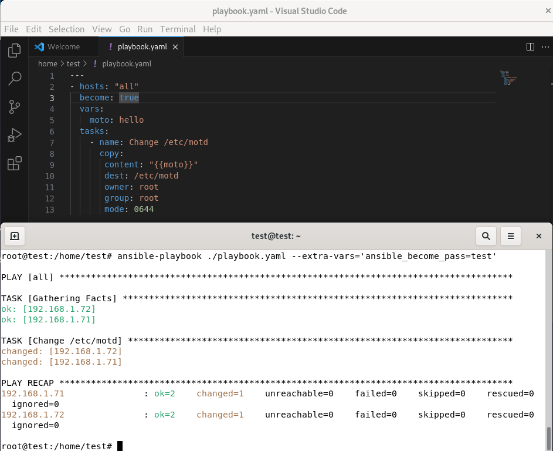
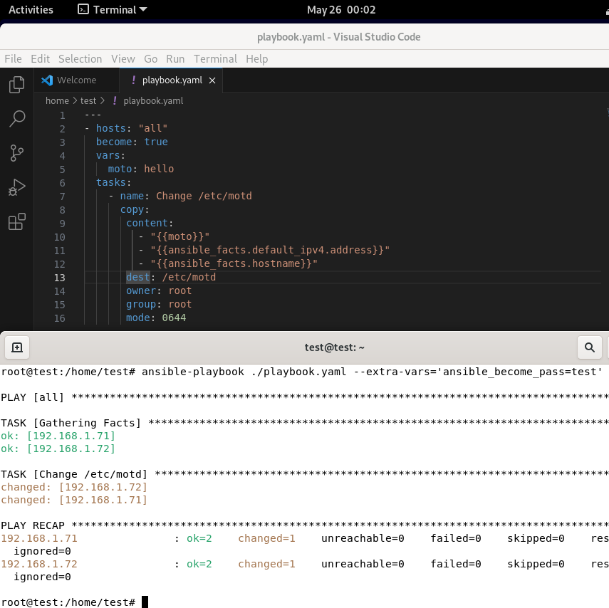
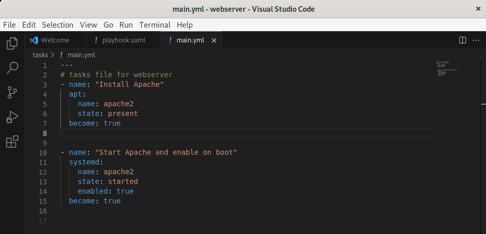
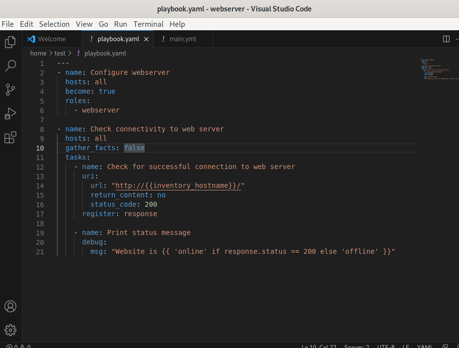

# Домашнее задание к занятию «Ansible.Часть 2»

### Оформление домашнего задания

1.  Домашнее задание выполните в [Google Docs](https://docs.google.com/) и отправьте на проверку ссылку на ваш документ в личном кабинете.
2.  В названии файла укажите номер лекции и фамилию студента. Пример названия: Ansible. Часть 2 — Александр Александров.
3.  Перед отправкой проверьте, что доступ для просмотра открыт всем, у кого есть ссылка. Если нужно прикрепить дополнительные ссылки, добавьте их в свой Google Docs.

Любые вопросы по решению задач задавайте в чате учебной группы.

---

### Задание 1

**Выполните действия, приложите файлы с плейбуками и вывод выполнения.**

Напишите три плейбука. При написании рекомендуем использовать текстовый редактор с подсветкой синтаксиса YAML.

Плейбуки должны:

1.  Скачать какой-либо архив, создать папку для распаковки и распаковать скаченный архив. Например, можете использовать [официальный сайт](https://kafka.apache.org/downloads) и зеркало Apache Kafka. При этом можно скачать как исходный код, так и бинарные файлы, запакованные в архив — в нашем задании не принципиально.

Ответ:

2.  Установить пакет tuned из стандартного репозитория вашей ОС. Запустить его, как демон — конфигурационный файл systemd появится автоматически при установке. Добавить tuned в автозагрузку.

Ответ:

3.  Изменить приветствие системы (motd) при входе на любое другое. Пожалуйста, в этом задании используйте переменную для задания приветствия. Переменную можно задавать любым удобным способом.

Ответ:

### Задание 2

**Выполните действия, приложите файлы с модифицированным плейбуком и вывод выполнения.**

Модифицируйте плейбук из пункта 3, задания 1. В качестве приветствия он должен установить IP-адрес и hostname управляемого хоста, пожелание хорошего дня системному администратору.

Ответ: 

### Задание 3

**Выполните действия, приложите архив с ролью и вывод выполнения.**

Ознакомьтесь со статьёй [«Ansible - это вам не bash»](https://habr.com/ru/post/494738/), сделайте соответствующие выводы и не используйте модули **shell** или **command** при выполнении задания.

Создайте плейбук, который будет включать в себя одну, созданную вами роль. Роль должна:

1.  Установить веб-сервер Apache на управляемые хосты.
2.  Сконфигурировать файл index.html c выводом характеристик каждого компьютера как веб-страницу по умолчанию для Apache. Необходимо включить CPU, RAM, величину первого HDD, IP-адрес. Используйте [Ansible facts](https://docs.ansible.com/ansible/latest/playbook_guide/playbooks_vars_facts.html) и [jinja2-template](https://linuxways.net/centos/how-to-use-the-jinja2-template-in-ansible/)
3.  Открыть порт 80, если необходимо, запустить сервер и добавить его в автозагрузку.
4.  Сделать проверку доступности веб-сайта (ответ 200, модуль uri).

В качестве решения:

-   предоставьте плейбук, использующий роль;
-   разместите архив созданной роли у себя на Google диске и приложите ссылку на роль в своём решении;
-   предоставьте скриншоты выполнения плейбука;
-   предоставьте скриншот браузера, отображающего сконфигурированный index.html в качестве сайта.

Give feedback

