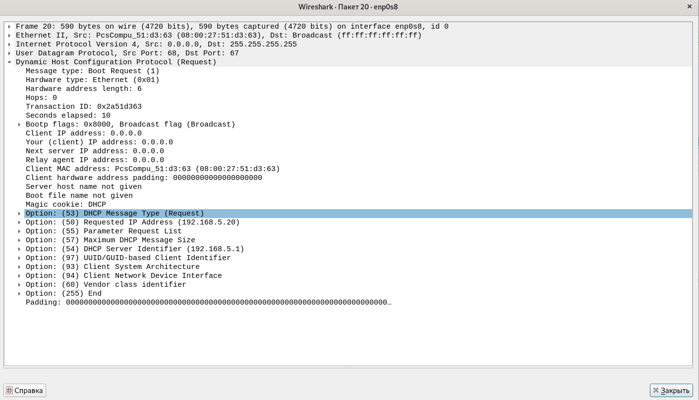
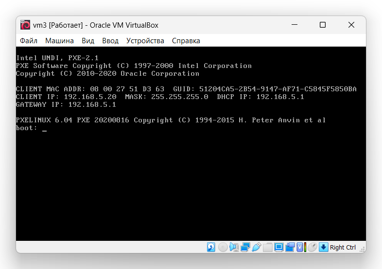

# Домашнее задание к занятию "4.10. DHCP, PXE"

**

**Домашнее задание выполните в [Google Docs](https://docs.google.com/) и отправьте в личном кабинете на проверку ссылку на ваш документ.**

Название файла должно содержать номер лекции и фамилию студента. Пример названия: "4.10. DHCP, PXE - Александр Александров"

Перед тем как выслать ссылку, убедитесь, что ее содержимое не является приватным (открыто на просмотр всем, у кого есть ссылка). Если необходимо прикрепить дополнительные ссылки, просто добавьте их в свой Google Docs.

Любые вопросы по решению задач задавайте в чате учебной группы.

---

### [](https://github.com/netology-code/snet-homeworks/blob/main/4-10.md#%D0%B7%D0%B0%D0%B4%D0%B0%D0%BD%D0%B8%D0%B5-1)Задание 1.

Для чего служит протокол `DHCP`?

Может ли работать сеть без `DHCP-сервера`?

_Приведите ответ в свободной форме._

Ответ: Протокол `DHCP` служит для автоматиченского получения ip адресов и других параметров, сетевыми устроиствами. Сеть может работать без `DHCP` правда в этом случае все необходимые для работы параметры нужно будет указывать вручную.

---

### [](https://github.com/netology-code/snet-homeworks/blob/main/4-10.md#%D0%B7%D0%B0%D0%B4%D0%B0%D0%BD%D0%B8%D0%B5-2)Задание 2.

На каком порту/портах работает `DHCP`?

_Приведите ответ в свободной форме._

Ответ: 67/68

---

### [](https://github.com/netology-code/snet-homeworks/blob/main/4-10.md#%D0%B7%D0%B0%D0%B4%D0%B0%D0%BD%D0%B8%D0%B5-3)Задание 3.

Какие настройки можно произвести используя опции?

Назовите 5.

_Приведите ответ в свободной форме._

Ответ: 1-задать маску подсети; 3-Список IP-адресов шлюзов по умолчанию; 6-Список IP-адресов серверов DNS; 12-Имя хоста клиента; 15-Имя домена DNS по умолчанию.

---

### [](https://github.com/netology-code/snet-homeworks/blob/main/4-10.md#%D0%B7%D0%B0%D0%B4%D0%B0%D0%BD%D0%B8%D0%B5-4)Задание 4.

Сконфигурируйте сервер `DHCP`.

_Пришлите получившийся конфигурационный файл._

Ответ:
```dhcpd.conf
#
# Sample configuration file for ISC dhcpd
#

# option definitions common to all supported networks...
option domain-name "example.org";
option domain-name-servers ns1.example.org, ns2.example.org;

default-lease-time 600;
max-lease-time 7200;

# The ddns-updates-style parameter controls whether or not the server will
# attempt to do a DNS update when a lease is confirmed. We default to the
# behavior of the version 2 packages ('none', since DHCP v2 didn't
# have support for DDNS.)
#ddns-update-style none;

# If this DHCP server is the official DHCP server for the local
# network, the authoritative directive should be uncommented.
authoritative;

# Use this to send dhcp log messages to a different log file (you also
# have to hack syslog.conf to complete the redirection).
#log-facility local7;

# No service will be given on this subnet, but declaring it helps the 
# DHCP server to understand the network topology.

#subnet 10.152.187.0 netmask 255.255.255.0 {
#}

# This is a very basic subnet declaration.

#subnet 10.254.239.0 netmask 255.255.255.224 {
#  range 10.254.239.10 10.254.239.20;
#  option routers rtr-239-0-1.example.org, rtr-239-0-2.example.org;
#}

# This declaration allows BOOTP clients to get dynamic addresses,
# which we don't really recommend.

#subnet 10.254.239.32 netmask 255.255.255.224 {
#  range dynamic-bootp 10.254.239.40 10.254.239.60;
#  option broadcast-address 10.254.239.31;
#  option routers rtr-239-32-1.example.org;
#}

# A slightly different configuration for an internal subnet.
subnet 192.168.5.0 netmask 255.255.255.0 {
  range 192.168.5.20 192.168.5.30;
#  option domain-name-servers ns1.internal.example.org;
#  option domain-name "internal.example.org";
  option routers 192.168.5.1;
#  option broadcast-address 10.5.5.31;
#  default-lease-time 600;
#  max-lease-time 7200;
}

# Hosts which require special configuration options can be listed in
# host statements.   If no address is specified, the address will be
# allocated dynamically (if possible), but the host-specific information
# will still come from the host declaration.

#host passacaglia {
#  hardware ethernet 0:0:c0:5d:bd:95;
#  filename "vmunix.passacaglia";
#  server-name "toccata.example.com";
#}

# Fixed IP addresses can also be specified for hosts.   These addresses
# should not also be listed as being available for dynamic assignment.
# Hosts for which fixed IP addresses have been specified can boot using
# BOOTP or DHCP.   Hosts for which no fixed address is specified can only
# be booted with DHCP, unless there is an address range on the subnet
# to which a BOOTP client is connected which has the dynamic-bootp flag
# set.
#host fantasia {
#  hardware ethernet 08:00:07:26:c0:a5;
#  fixed-address fantasia.example.com;
#}

# You can declare a class of clients and then do address allocation
# based on that.   The example below shows a case where all clients
# in a certain class get addresses on the 10.17.224/24 subnet, and all
# other clients get addresses on the 10.0.29/24 subnet.

#class "foo" {
#  match if substring (option vendor-class-identifier, 0, 4) = "SUNW";
#}

#shared-network 224-29 {
#  subnet 10.17.224.0 netmask 255.255.255.0 {
#    option routers rtr-224.example.org;
#  }
#  subnet 10.0.29.0 netmask 255.255.255.0 {
#    option routers rtr-29.example.org;
#  }
#  pool {
#    allow members of "foo";
#    range 10.17.224.10 10.17.224.250;
#  }
#  pool {
#    deny members of "foo";
#    range 10.0.29.10 10.0.29.230;
#  }
#}
```


---

## [](https://github.com/netology-code/snet-homeworks/blob/main/4-10.md#%D0%B4%D0%BE%D0%BF%D0%BE%D0%BB%D0%BD%D0%B8%D1%82%D0%B5%D0%BB%D1%8C%D0%BD%D1%8B%D0%B5-%D0%B7%D0%B0%D0%B4%D0%B0%D0%BD%D0%B8%D1%8F-%D1%81%D0%BE-%D0%B7%D0%B2%D0%B5%D0%B7%D0%B4%D0%BE%D1%87%D0%BA%D0%BE%D0%B9)Дополнительные задания (со звездочкой*)

Эти задания дополнительные (не обязательные к выполнению) и никак не повлияют на получение вами зачета по этому домашнему заданию. Вы можете их выполнить, если хотите глубже и/или шире разобраться в материале.

### [](https://github.com/netology-code/snet-homeworks/blob/main/4-10.md#%D0%B7%D0%B0%D0%B4%D0%B0%D0%BD%D0%B8%D0%B5-5)Задание 5.

Поймайте в сети пакеты `DHCP` любым сниффером.

_Пришлите скриншот пойманого одного пакета с объяснением что это за пакет, какой шаг получения сетевых настроек._

Ответ:

dhcprequest отправляется клиентом, это широковещательный запрос на выбранную клиентом конфигурацию. Запрос отправляется широковещательно для того чтобы другие сервера понимали что их предложение отклонено. Это третий шаг получения сетевых настроек `DHCP`

---

### [](https://github.com/netology-code/snet-homeworks/blob/main/4-10.md#%D0%B7%D0%B0%D0%B4%D0%B0%D0%BD%D0%B8%D0%B5-6)Задание 6.

Сконфигурируйте сервер `PXE`, выложите любой образ.

_Пришлите скриншот клиента, который получил настройки и подключился к `PXE-серверу`._

Ответ:
