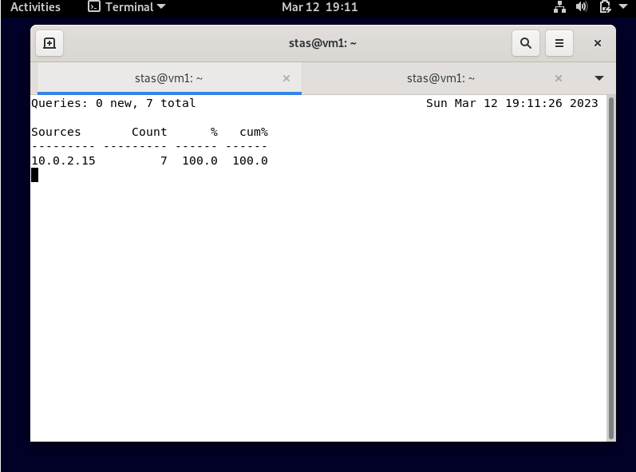
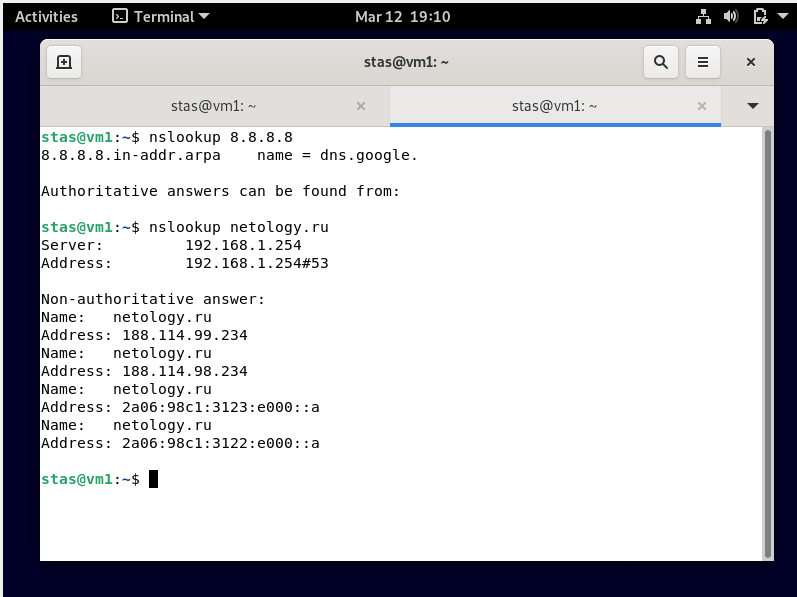

# Домашнее задание к занятию "4.11. DNS"

**

**Домашнее задание выполните в [Google Docs](https://docs.google.com/) и отправьте в личном кабинете на проверку ссылку на ваш документ.**

Название файла должно содержать номер лекции и фамилию студента. Пример названия: "4.11. DNS - Александр Александров"

Перед тем как выслать ссылку, убедитесь, что ее содержимое не является приватным (открыто на просмотр всем, у кого есть ссылка). Если необходимо прикрепить дополнительные ссылки, просто добавьте их в свой Google Docs.

Любые вопросы по решению задач задавайте в чате учебной группы.

---

### Задание 1.

Может ли компьютер работать без `DNS`? Будет ли работать сеть если в ней нет `DNS-сервера`?

_Приведите ответ в свободной форме._

Ответ: Компьютер может работь без DNS сервера, как и сеть, правда тогда придется пользоваться не доменными именами а ip адресами.

---

### Задание 2.

Кто выдает DNS имена?

_Приведите ответ в свободной форме._

Ответ: Организации, уполномоченные создавать новые доменные имена называются регистраторами. Например в РФ существует Кординационный центр национального домена сети Интернет, который регулирует работу регистраторов.

---

### Задание 3.

Где в Linux настраивается DNS-клиент в простейшем случае?

_Приведите ответ в свободной форме._

Ответ:  В файле `etc/hosts` , также в файлах `/etc/resolv.conf` и `/etc/nsswitch.conf` настраивается список DNS-серверов и 

---

### Задание 4.

Для чего служит ресурсная DNS запись типа `MX`?

_Приведите ответ в свободной форме._

Ответ: Для указания почтового шлюза домена.

---

## Дополнительные задания (со звездочкой*)

Эти задания дополнительные (не обязательные к выполнению) и никак не повлияют на получение вами зачета по этому домашнему заданию. Вы можете их выполнить, если хотите глубже и/или шире разобраться в материале.

### Задание 5.

Настройте кэширующий DNS сервер `BIND`.

С любого клиента отправьте запрос на преобразование адреса `netology.ru`.

С помощью утилиты `dnstop` посмотрите какие входящие и исходящие запросы обрабатывались DNS-сервером.

_Пришлите скриншот, на котором в выводе команды `dnstop` будут отбражены внешние DNS-сервера, на которые были отправлены рекурсивные запросы для преобразования адреса `netology.ru`._

Ответ:

