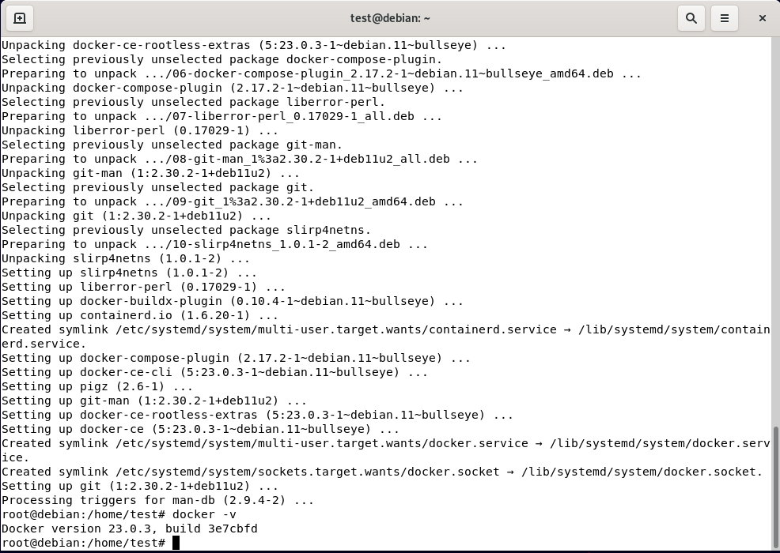
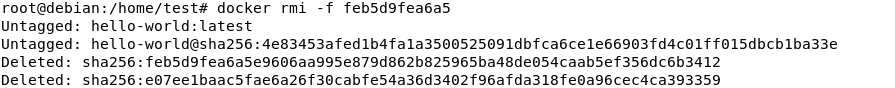
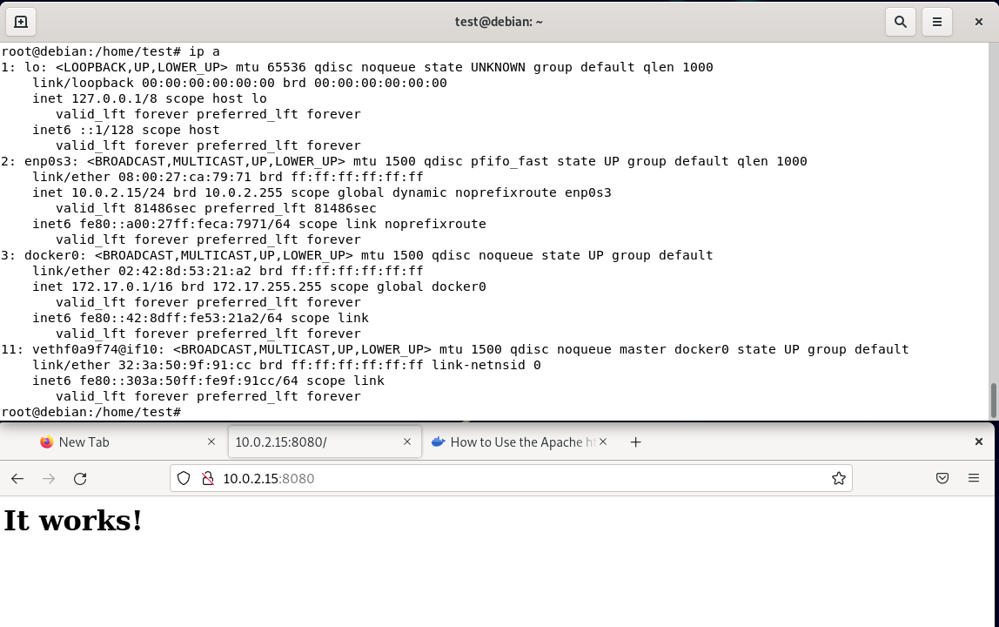
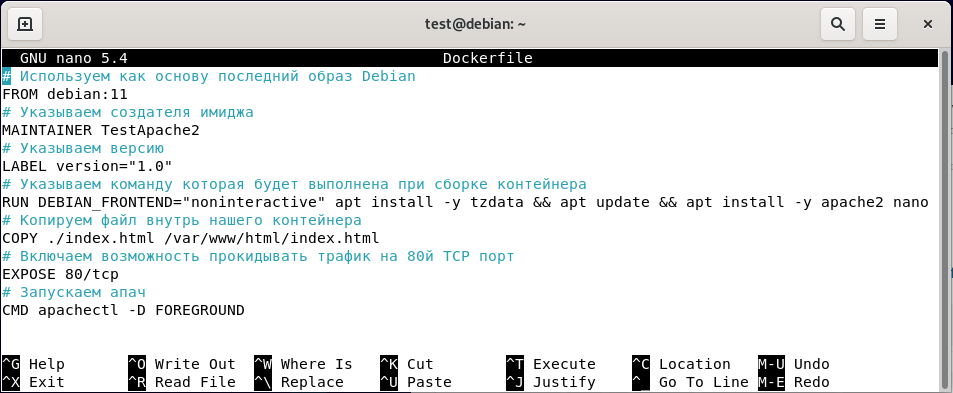
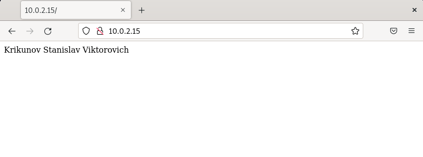

# Домашнее задание к занятию «Docker. Часть 1»

### [](https://github.com/netology-code/sdvps-homeworks/blob/main/6-03.md#%D0%BE%D1%84%D0%BE%D1%80%D0%BC%D0%BB%D0%B5%D0%BD%D0%B8%D0%B5-%D0%B4%D0%BE%D0%BC%D0%B0%D1%88%D0%BD%D0%B5%D0%B3%D0%BE-%D0%B7%D0%B0%D0%B4%D0%B0%D0%BD%D0%B8%D1%8F)Оформление домашнего задания

1.  Домашнее задание выполните в [Google Docs](https://docs.google.com/) и отправьте на проверку ссылку на ваш документ в личном кабинете.
2.  В названии файла укажите номер лекции и фамилию студента. Пример названия: 6.3. Docker. Часть 1 — Александр Александров.
3.  Перед отправкой проверьте, что доступ для просмотра открыт всем, у кого есть ссылка. Если нужно прикрепить дополнительные ссылки, добавьте их в свой Google Docs.

Любые вопросы по решению задач задавайте в чате учебной группы.

---

## [](https://github.com/netology-code/sdvps-homeworks/blob/main/6-03.md#%D0%B2%D0%B0%D0%B6%D0%BD%D0%BE)Важно

Перед отправкой работы на проверку удаляйте неиспользуемые ресурсы. Это нужно, чтобы предупредить неконтролируемый расход средств, полученных после использования промокода.

Рекомендации [по ссылке](https://github.com/netology-code/sdvps-homeworks/tree/main/recommend).

---

### [](https://github.com/netology-code/sdvps-homeworks/blob/main/6-03.md#%D0%B7%D0%B0%D0%B4%D0%B0%D0%BD%D0%B8%D0%B5-1)Задание 1

**Ответьте на вопрос в свободной форме.**

Чем контейнеризация отличается от виртуализации?

Ответ: Контейнеризация упаковывает приложение со всеми его зависимостями в контейнер, при этом используется операционная система хоста что является полее экономичным решением в плане ресурсов. Виртуализация позволяет создавать независимые, изолированные виртуальные машины с  выделеным количеством собственных ресурсов таких как процессор, память, дисковое пространство и имеют собственную ОС. 

---

### [](https://github.com/netology-code/sdvps-homeworks/blob/main/6-03.md#%D0%B7%D0%B0%D0%B4%D0%B0%D0%BD%D0%B8%D0%B5-2)Задание 2

**Выполните действия:**

1.  Установите Docker.
2.  Приложите скриншот.
Ответ:

---

### [](https://github.com/netology-code/sdvps-homeworks/blob/main/6-03.md#%D0%B7%D0%B0%D0%B4%D0%B0%D0%BD%D0%B8%D0%B5-3)Задание 3

**Выполните действия:**

1.  Запустите образ hello-world.
2.  Приложите скриншот.
Ответ:

---

### [](https://github.com/netology-code/sdvps-homeworks/blob/main/6-03.md#%D0%B7%D0%B0%D0%B4%D0%B0%D0%BD%D0%B8%D0%B5-4)Задание 4

**Выполните действия:**

1.  Удалите образ hello-world.
2.  Приложите скриншот.
Ответ:


---

## [](https://github.com/netology-code/sdvps-homeworks/blob/main/6-03.md#%D0%B4%D0%BE%D0%BF%D0%BE%D0%BB%D0%BD%D0%B8%D1%82%D0%B5%D0%BB%D1%8C%D0%BD%D1%8B%D0%B5-%D0%B7%D0%B0%D0%B4%D0%B0%D0%BD%D0%B8%D1%8F-%D1%81%D0%BE-%D0%B7%D0%B2%D1%91%D0%B7%D0%B4%D0%BE%D1%87%D0%BA%D0%BE%D0%B9)Дополнительные задания* (со звёздочкой)

Их выполнение необязательное и не влияет на получение зачёта по домашнему заданию. Можете их решить, если хотите лучше разобраться в материале.

---

### [](https://github.com/netology-code/sdvps-homeworks/blob/main/6-03.md#%D0%B7%D0%B0%D0%B4%D0%B0%D0%BD%D0%B8%D0%B5-5)Задание 5*

1.  Найдите в Docker Hub образ apache и установите его.
2.  Приложите:

-   скриншоты сетевых настроек вашей виртуальной машины;
-   скриншоты работающих контейнеров;
-   скриншот браузера, где вы открыли дефолтную страницу вашего apache внутри контейнера.
``` 
# Забыл заскринить команду 
docker pull httpd
```


---

### [](https://github.com/netology-code/sdvps-homeworks/blob/main/6-03.md#%D0%B7%D0%B0%D0%B4%D0%B0%D0%BD%D0%B8%D0%B5-6)Задание 6*

1.  Создайте свой Docker образ с Apache2 и подмените стандартную страницу index.html на страницу, содержащую ваши ФИО.
2.  Приложите:

-   скриншот содержимого Dockerfile;
-   скриншот браузера, где apache2 из вашего контейнера выводит ваши ФИО.
