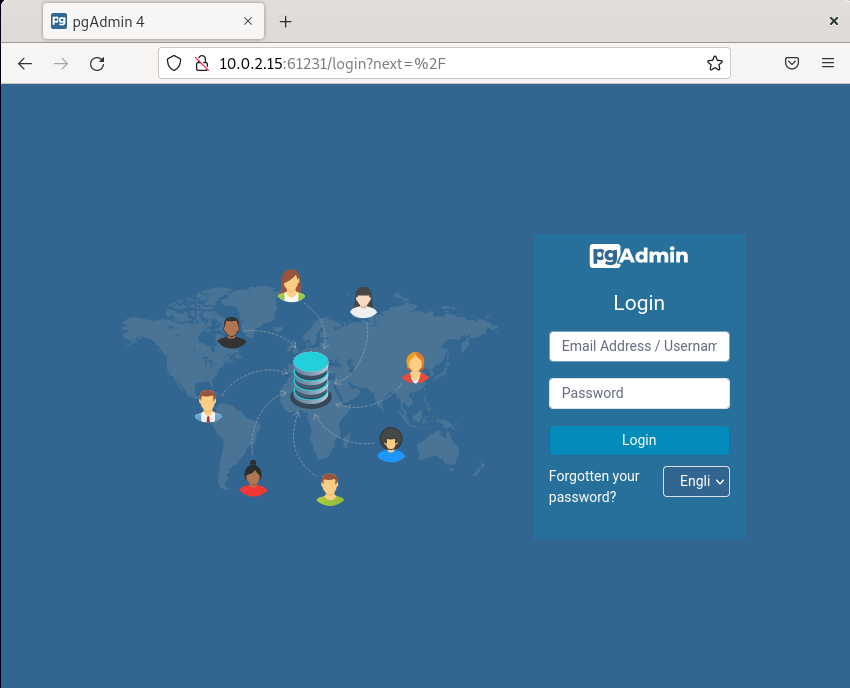
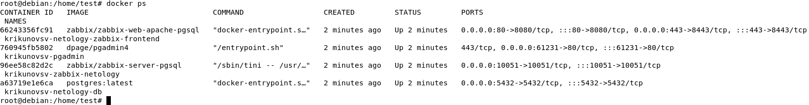
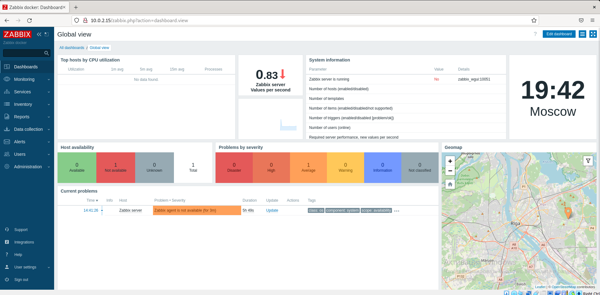
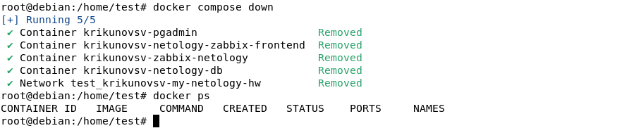

# Домашнее задание к занятию «Docker. Часть 2»

### [](https://github.com/netology-code/sdvps-homeworks/blob/main/6-04.md#%D0%BE%D1%84%D0%BE%D1%80%D0%BC%D0%BB%D0%B5%D0%BD%D0%B8%D0%B5-%D0%B4%D0%BE%D0%BC%D0%B0%D1%88%D0%BD%D0%B5%D0%B3%D0%BE-%D0%B7%D0%B0%D0%B4%D0%B0%D0%BD%D0%B8%D1%8F)Оформление домашнего задания

1.  Домашнее задание выполните в [Google Docs](https://docs.google.com/) и отправьте на проверку ссылку на ваш документ в личном кабинете.
2.  В названии файла укажите номер лекции и фамилию студента. Пример названия: 6.4. Docker. Часть 2 — Александр Александров.
3.  Код решения размещайте в отдельном файле на вашем Google-диске, это облегчит проверку вашей работы.
4.  Перед отправкой проверьте, что доступ для просмотра открыт всем, у кого есть ссылка. Если нужно прикрепить дополнительные ссылки, добавьте их в свой Google Docs.

**Правила выполнения заданий к занятию «6.4. Docker. Часть 2»**

-   Все задания выполняйте на основе конфигов из лекции.
-   В заданиях описаны те параметры, которые необходимо изменить.
-   Если параметр не упомянут вообще, значит, его нужно оставить таким, какой он был в лекции.
-   Если в каком-то задании, например, в задании 2, нужно изменить параметр, подразумевается, что во всех следующих заданиях будет использоваться уже изменённый параметр.
-   Выполнив все задания без звёздочки, вы должны получить полнофункциональный сервис.

Любые вопросы по решению задач задавайте в чате учебной группы.

---

## [](https://github.com/netology-code/sdvps-homeworks/blob/main/6-04.md#%D0%B2%D0%B0%D0%B6%D0%BD%D0%BE)Важно

Перед отправкой работы на проверку удаляйте неиспользуемые ресурсы. Это нужно, чтобы предупредить неконтролируемый расход средств, полученных после использования промокода.

Рекомендации [по ссылке](https://github.com/netology-code/sdvps-homeworks/tree/main/recommend).

---

### [](https://github.com/netology-code/sdvps-homeworks/blob/main/6-04.md#%D0%B7%D0%B0%D0%B4%D0%B0%D0%BD%D0%B8%D0%B5-1)Задание 1

**Напишите ответ в свободной форме, не больше одного абзаца текста.**

Установите Docker Compose и опишите, для чего он нужен и как может улучшить вашу жизнь.

Ответ: Docker Compose это инструмент для описания многоконтейнерных приложений. С его помощью можно собрать один файл, в котором наглядно описываются все контейнеры. Еще Docker Compose позволяет собирать, останавливать и запускать файлы одной командой.

---

### [](https://github.com/netology-code/sdvps-homeworks/blob/main/6-04.md#%D0%B7%D0%B0%D0%B4%D0%B0%D0%BD%D0%B8%D0%B5-2)Задание 2

**Выполните действия и приложите текст конфига на этом этапе.**

Создайте файл docker-compose.yml и внесите туда первичные настройки:

-   version;
-   services;
-   networks.

При выполнении задания используйте подсеть 172.22.0.0. Ваша подсеть должна называться: <ваши фамилия и инициалы>-my-netology-hw.

Ответ:
```
version: "3"
services:


networks:
krikunovsv-my-netology-hw:
  driver: bridge
  ipam:
    config:
    - subnet: 172.22.0.0/24

```
---

### [](https://github.com/netology-code/sdvps-homeworks/blob/main/6-04.md#%D0%B7%D0%B0%D0%B4%D0%B0%D0%BD%D0%B8%D0%B5-3)Задание 3

**Выполните действия и приложите текст конфига текущего сервиса:**

1.  Установите PostgreSQL с именем контейнера <ваши фамилия и инициалы>-netology-db.
2.  Предсоздайте БД <ваши фамилия и инициалы>-db.
3.  Задайте пароль пользователя postgres, как <ваши фамилия и инициалы>12!3!!
4.  Пример названия контейнера: ivanovii-netology-db.
5.  Назначьте для данного контейнера статический IP из подсети 172.22.0.0/24.

Ответ:
```
version: "3"
services:
  krikunovsv-netology-db:
    image: postgres:latest
    container_name: krikunovsv-netology-db
    ports:
      - 5432:5432
    volumes:
      - ./pg_data:/var/lib/postgresql/data/pgdata
    environment:
      POSTGRES_PASSWORD: krikunovsv12!3!!
      POSTGRES_DB: krikunovsv-db
      PGDATA: /var/lib/postgresql/data/pgdata
    networks:
       krikunovsv-my-netology-hw:
         ipv4_address: 172.22.0.2
    restart: always

networks:
  krikunovsv-my-netology-hw:
    driver: bridge
    ipam:
      config:
      - subnet: 172.22.0.0/24

```


---

### [](https://github.com/netology-code/sdvps-homeworks/blob/main/6-04.md#%D0%B7%D0%B0%D0%B4%D0%B0%D0%BD%D0%B8%D0%B5-4)Задание 4

**Выполните действия:**

1.  Установите pgAdmin с именем контейнера <ваши фамилия и инициалы>-pgadmin.
2.  Задайте логин администратора pgAdmin <ваши фамилия и инициалы>@ilove-netology.com и пароль на выбор.
3.  Назначьте для данного контейнера статический IP из подсети 172.22.0.0/24.
4.  Прокиньте на 80 порт контейнера порт 61231.

В качестве решения приложите:

-   текст конфига текущего сервиса;
-   скриншот админки pgAdmin.

Ответ: 
```
version: "3"
services:
  krikunovsv-netology-db:
    image: postgres:latest
    container_name: krikunovsv-netology-db
    ports:
      - 5432:5432
    volumes:
      - ./pg_data:/var/lib/postgresql/data/pgdata
    environment:
      POSTGRES_PASSWORD: krikunovsv12!3!!
      POSTGRES_DB: krikunovsv-db
      PGDATA: /var/lib/postgresql/data/pgdata
    networks:
       krikunovsv-my-netology-hw:
         ipv4_address: 172.22.0.2
    restart: always

  pgadmin:
    image: dpage/pgadmin4
    container_name: krikunovsv-pgadmin
    environment:
      PGADMIN_DEFAULT_EMAIL: krikunovsv@ilove-netology.com
      PGADMIN_DEFAULT_PASSWORD: 123
    ports:
      - "61231:80"
    networks:
      krikunovsv-my-netology-hw:
        ipv4_address: 172.22.0.3
    restart: always

networks:
  krikunovsv-my-netology-hw:
    driver: bridge
    ipam:
      config:
      - subnet: 172.22.0.0/24

```

---

### [](https://github.com/netology-code/sdvps-homeworks/blob/main/6-04.md#%D0%B7%D0%B0%D0%B4%D0%B0%D0%BD%D0%B8%D0%B5-5)Задание 5

**Выполните действия и приложите текст конфига текущего сервиса:**

1.  Установите Zabbix Server с именем контейнера <ваши фамилия и инициалы>-zabbix-netology.
2.  Настройте его подключение к вашему СУБД.
3.  Назначьте для данного контейнера статический IP из подсети 172.22.0.0/24.
Ответ:
```
version: "3"
services:
  krikunovsv-netology-db:
    image: postgres:latest
    container_name: krikunovsv-netology-db
    ports:
      - 5432:5432
    volumes:
      - ./pg_data:/var/lib/postgresql/data/pgdata
    environment:
      POSTGRES_PASSWORD: krikunovsv12!3!!
      POSTGRES_DB: krikunovsv-db
      PGDATA: /var/lib/postgresql/data/pgdata
    networks:
       krikunovsv-my-netology-hw:
         ipv4_address: 172.22.0.2
    restart: always

  pgadmin:
    image: dpage/pgadmin4
    container_name: krikunovsv-pgadmin
    environment:
      PGADMIN_DEFAULT_EMAIL: krikunovsv@ilove-netology.com
      PGADMIN_DEFAULT_PASSWORD: 123
    ports:
      - "61231:80"
    networks:
      krikunovsv-my-netology-hw:
        ipv4_address: 172.22.0.3
    restart: always

zabbix-server:
    image: zabbix/zabbix-server-pgsql
    links:
      - krikunovsv-netology-db
    container_name: krikunovsv-zabbix-netology
    environment:
      DB_SERVER_HOST: '172.22.0.2'
      POSTGRES_USER: postgres
      POSTGRES_PASSWORD: krikunovsv12!3!!
    ports:
      - "10051:10051"
    networks:
      krikunovsv-my-netology-hw:
        ipv4_address: 172.22.0.4
    restart: always

networks:
  krikunovsv-my-netology-hw:
    driver: bridge
    ipam:
      config:
      - subnet: 172.22.0.0/24

```

---

### [](https://github.com/netology-code/sdvps-homeworks/blob/main/6-04.md#%D0%B7%D0%B0%D0%B4%D0%B0%D0%BD%D0%B8%D0%B5-6)Задание 6

**Выполните действия и приложите текст конфига текущего сервиса:**

1.  Установите Zabbix Frontend с именем контейнера <ваши фамилия и инициалы>-netology-zabbix-frontend.
2.  Настройте его подключение к вашему СУБД.
3.  Назначьте для данного контейнера статический IP из подсети 172.22.0.0/24.

Ответ:
```
version: "3"
services:
  krikunovsv-netology-db:
    image: postgres:latest
    container_name: krikunovsv-netology-db
    ports:
      - 5432:5432
    volumes:
      - ./pg_data:/var/lib/postgresql/data/pgdata
    environment:
      POSTGRES_PASSWORD: krikunovsv12!3!!
      POSTGRES_DB: krikunovsv-db
      PGDATA: /var/lib/postgresql/data/pgdata
    networks:
       krikunovsv-my-netology-hw:
         ipv4_address: 172.22.0.2
    restart: always

  pgadmin:
    image: dpage/pgadmin4
    container_name: krikunovsv-pgadmin
    environment:
      PGADMIN_DEFAULT_EMAIL: krikunovsv@ilove-netology.com
      PGADMIN_DEFAULT_PASSWORD: 123
    ports:
      - "61231:80"
    networks:
      krikunovsv-my-netology-hw:
        ipv4_address: 172.22.0.3
    restart: always

zabbix-server:
    image: zabbix/zabbix-server-pgsql
    container_name: krikunovsv-zabbix-netology
    environment:
      DB_SERVER_HOST: '172.22.0.2'
      POSTGRES_USER: postgres
      POSTGRES_PASSWORD: krikunovsv12!3!!
    ports:
      - "10051:10051"
    networks:
      krikunovsv-my-netology-hw:
        ipv4_address: 172.22.0.4
    restart: always

zabbix_wgui:
    image: zabbix/zabbix-web-apache-pgsql
    container_name: krikunovsv-netology-zabbix-frontend
    environment:
      DB_SERVER_HOST: '172.22.0.2'
      POSTGRES_USER: 'postgres'
      POSTGRES_PASSWORD: krikunovsv12!3!!
      ZBX_SERVER_HOST: "zabbix_wgui"
      PHP_TZ: "Europe/Moscow"
    ports:
      - "80:8080"
      - "443:8443"
    networks:
      krikunovsv-my-netology-hw:
        ipv4_address: 172.22.0.5
    restart: always

networks:
  krikunovsv-my-netology-hw:
    driver: bridge
    ipam:
      config:
      - subnet: 172.22.0.0/24
```

---

### [](https://github.com/netology-code/sdvps-homeworks/blob/main/6-04.md#%D0%B7%D0%B0%D0%B4%D0%B0%D0%BD%D0%B8%D0%B5-7)Задание 7

**Выполните действия.**

Настройте линки, чтобы контейнеры запускались только в момент, когда запущены контейнеры, от которых они зависят.

В качестве решения приложите:

-   текст конфига **целиком**;
-   скриншот команды docker ps;
-   скриншот авторизации в админке Zabbix.
Ответ:
```
version: "3"
services:
  krikunovsv-netology-db:
    image: postgres:latest
    container_name: krikunovsv-netology-db
    ports:
      - 5432:5432
    volumes:
      - ./pg_data:/var/lib/postgresql/data/pgdata
    environment:
      POSTGRES_PASSWORD: krikunovsv12!3!!
      POSTGRES_DB: krikunovsv-db
      PGDATA: /var/lib/postgresql/data/pgdata
    networks:
       krikunovsv-my-netology-hw:
         ipv4_address: 172.22.0.2
    restart: always

  pgadmin:
    image: dpage/pgadmin4
    links:
      - krikunovsv-netology-db
    container_name: krikunovsv-pgadmin
    environment:
      PGADMIN_DEFAULT_EMAIL: krikunovsv@ilove-netology.com
      PGADMIN_DEFAULT_PASSWORD: 123
    ports:
      - "61231:80"
    networks:
      krikunovsv-my-netology-hw:
        ipv4_address: 172.22.0.3
    restart: always

zabbix-server:
    image: zabbix/zabbix-server-pgsql
    links:
      - krikunovsv-netology-db
    container_name: krikunovsv-zabbix-netology
    environment:
      DB_SERVER_HOST: '172.22.0.2'
      POSTGRES_USER: postgres
      POSTGRES_PASSWORD: krikunovsv12!3!!
    ports:
      - "10051:10051"
    networks:
      krikunovsv-my-netology-hw:
        ipv4_address: 172.22.0.4
    restart: always

zabbix_wgui:
    image: zabbix/zabbix-web-apache-pgsql
    links:
      - krikunovsv-netology-db
      - zabbix-server
    container_name: krikunovsv-netology-zabbix-frontend
    environment:
      DB_SERVER_HOST: '172.22.0.2'
      POSTGRES_USER: 'postgres'
      POSTGRES_PASSWORD: krikunovsv12!3!!
      ZBX_SERVER_HOST: "zabbix_wgui"
      PHP_TZ: "Europe/Moscow"
    ports:
      - "80:8080"
      - "443:8443"
    networks:
      krikunovsv-my-netology-hw:
        ipv4_address: 172.22.0.5
    restart: always

networks:
  krikunovsv-my-netology-hw:
    driver: bridge
    ipam:
      config:
      - subnet: 172.22.0.0/24
```


---

### [](https://github.com/netology-code/sdvps-homeworks/blob/main/6-04.md#%D0%B7%D0%B0%D0%B4%D0%B0%D0%BD%D0%B8%D0%B5-8)Задание 8

**Выполните действия:**

1.  Убейте все контейнеры и потом удалите их.
2.  Приложите скриншот консоли с проделанными действиями.

---

## [](https://github.com/netology-code/sdvps-homeworks/blob/main/6-04.md#%D0%B4%D0%BE%D0%BF%D0%BE%D0%BB%D0%BD%D0%B8%D1%82%D0%B5%D0%BB%D1%8C%D0%BD%D1%8B%D0%B5-%D0%B7%D0%B0%D0%B4%D0%B0%D0%BD%D0%B8%D1%8F-%D1%81%D0%BE-%D0%B7%D0%B2%D1%91%D0%B7%D0%B4%D0%BE%D1%87%D0%BA%D0%BE%D0%B9)Дополнительные задания* (со звёздочкой)

Их выполнение необязательное и не влияет на получение зачёта по домашнему заданию. Можете их решить, если хотите лучше разобраться в материале.

---

### [](https://github.com/netology-code/sdvps-homeworks/blob/main/6-04.md#%D0%B7%D0%B0%D0%B4%D0%B0%D0%BD%D0%B8%D0%B5-9)Задание 9*

Запустите свой сценарий на чистом железе без предзагруженных образов.

**Ответьте на вопросы в свободной форме:**

1.  Сколько ушло времени на то, чтобы развернуть на чистом железе написанный вами сценарий?
2.  Чем вы занимались в процессе создания сценария так, как это видите вы?
3.  Что бы вы улучшили в сценарии развёртывания?

Ответ:  
1.  Сложно сказать, около 2 часов, с перерывами)) 
2. Читал руководство, пытал GPT чтобы он обьяснял непонятные мне строки, когда допёр описывал докерфалы вместо образов, а потом те же действия что в задании 1-7.
3. ¯\_(ツ)_/¯  настройки SSL для zabbix сервера? 