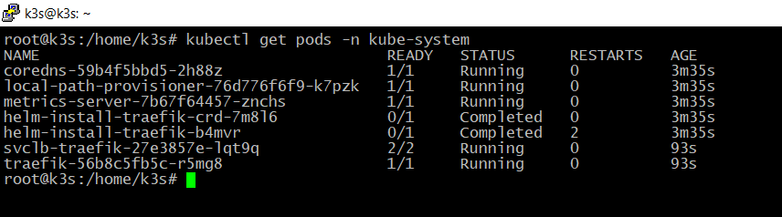

# Домашнее задание к занятию «Kubernetes. Часть 1»

### [](https://github.com/netology-code/sdvps-homeworks/blob/main/6-05.md#%D0%BE%D1%84%D0%BE%D1%80%D0%BC%D0%BB%D0%B5%D0%BD%D0%B8%D0%B5-%D0%B4%D0%BE%D0%BC%D0%B0%D1%88%D0%BD%D0%B5%D0%B3%D0%BE-%D0%B7%D0%B0%D0%B4%D0%B0%D0%BD%D0%B8%D1%8F)Оформление домашнего задания

1.  Домашнее задание выполните в [Google Docs](https://docs.google.com/) и отправьте на проверку ссылку на ваш документ в личном кабинете.
2.  В названии файла укажите номер лекции и фамилию студента. Пример названия: 6.5. Kubernetes. Часть 1 — Александр Александров.
3.  Перед отправкой проверьте, что доступ для просмотра открыт всем, у кого есть ссылка. Если нужно прикрепить дополнительные ссылки, добавьте их в свой Google Docs.

Любые вопросы по решению задач задавайте в чате учебной группы.

---

## [](https://github.com/netology-code/sdvps-homeworks/blob/main/6-05.md#%D0%B2%D0%B0%D0%B6%D0%BD%D0%BE)Важно

Перед отправкой работы на проверку удаляйте неиспользуемые ресурсы. Это нужно, чтобы предупредить неконтролируемый расход средств, полученных после использования промокода.

Рекомендации [по ссылке](https://github.com/netology-code/sdvps-homeworks/tree/main/recommend).

---

### [](https://github.com/netology-code/sdvps-homeworks/blob/main/6-05.md#%D0%B7%D0%B0%D0%B4%D0%B0%D0%BD%D0%B8%D0%B5-1)Задание 1

**Выполните действия:**

1.  Запустите Kubernetes локально, используя k3s или minikube на свой выбор.
2.  Добейтесь стабильной работы всех системных контейнеров.
3.  В качестве ответа пришлите скриншот результата выполнения команды kubectl get po -n kube-system.
Ответ:

---

### [](https://github.com/netology-code/sdvps-homeworks/blob/main/6-05.md#%D0%B7%D0%B0%D0%B4%D0%B0%D0%BD%D0%B8%D0%B5-2)Задание 2

Есть файл с деплоем:

```
---
Version: apps/v1
kind: Deployment
metadata:
  name: redis
spec:
  selector:
    matchLabels:
      app: redis
  replicas: 1
  template:
    metadata:
      labels:
        app: redis
    spec:
      containers:
      - name: master
        image: bitnami/redis
        env:
         - name: REDIS_PASSWORD
           value: password123
        ports:
        - containerPort: 6379
```

---

**Выполните действия:**

1.  Измените файл с учётом условий:

-   redis должен запускаться без пароля;
-   создайте Service, который будет направлять трафик на этот Deployment;
-   версия образа redis должна быть зафиксирована на 6.0.13.

2.  Запустите Deployment в своём кластере и добейтесь его стабильной работы.
3.  В качестве решения пришлите получившийся файл.

Ответ:
```
---
apiVersion: apps/v1
kind: Deployment
metadata:
  name: redis
spec:
  selector:
    matchLabels:
      app: redis
  replicas: 1
  template:
    metadata:
      labels:
        app: redis
    spec:
      containers:
      - name: master
        image: bitnami/redis:6.0.13
        env:
         - name: ALLOW_EMPTY_PASSWORD
           value: "yes"
        ports:
         - containerPort: 6379
---
apiVersion: v1
kind: Service
metadata:
  name: redis
spec:
  selector:
    app: redis
  ports:
    - protocol: TCP
      port: 6379
      targetPort: 6379

```
---

### [](https://github.com/netology-code/sdvps-homeworks/blob/main/6-05.md#%D0%B7%D0%B0%D0%B4%D0%B0%D0%BD%D0%B8%D0%B5-3)Задание 3

**Выполните действия:**

1.  Напишите команды kubectl для контейнера из предыдущего задания:

-   выполнения команды ps aux внутри контейнера;
-   просмотра логов контейнера за последние 5 минут;
-   удаления контейнера;
-   проброса порта локальной машины в контейнер для отладки.

2.  В качестве решения пришлите получившиеся команды.
```
sudo kubectl exec -it redis-58c6d4947b-qlcsj
ps aux

sudo kubectl logs --since=5m  redis-58c6d4947b-qlcsj

kubectl delete pod redis-58c6d4947b-qlcsj

kubectl port-forward pod/redis-58c6d4947b-qlcsj 23456:6379
```
---

## [](https://github.com/netology-code/sdvps-homeworks/blob/main/6-05.md#%D0%B4%D0%BE%D0%BF%D0%BE%D0%BB%D0%BD%D0%B8%D1%82%D0%B5%D0%BB%D1%8C%D0%BD%D1%8B%D0%B5-%D0%B7%D0%B0%D0%B4%D0%B0%D0%BD%D0%B8%D1%8F-%D1%81%D0%BE-%D0%B7%D0%B2%D1%91%D0%B7%D0%B4%D0%BE%D1%87%D0%BA%D0%BE%D0%B9)Дополнительные задания* (со звёздочкой)

Их выполнение необязательное и не влияет на получение зачёта по домашнему заданию. Можете их решить, если хотите лучше разобраться в материале.

---

### [](https://github.com/netology-code/sdvps-homeworks/blob/main/6-05.md#%D0%B7%D0%B0%D0%B4%D0%B0%D0%BD%D0%B8%D0%B5-4)Задание 4*

Есть конфигурация nginx:

```
location / {
    add_header Content-Type text/plain;
    return 200 'Hello from k8s';
}
```

**Выполните действия:**

1.  Напишите yaml-файлы для развёртки nginx, в которых будут присутствовать:

-   ConfigMap с конфигом nginx;
-   Deployment, который бы подключал этот configmap;
-   Ingress, который будет направлять запросы по префиксу /test на наш сервис.

2.  В качестве решения пришлите получившийся файл.


Ответ:
```
# ConfigMap.yaml
apiVersion: v1
kind: ConfigMap
metadata:
  name: nginx-config
data:
  nginx.conf: |
    location / {
      add_header Content-Type text/plain;
      return 200 'Hello from k8s';
    }
---
# Deployment.yaml
apiVersion: apps/v1
kind: Deployment
metadata:
  name: nginx-deployment
spec:
  selector:
    matchLabels:
      app: nginx
  replicas: 1
  template:
    metadata:
      labels:
        app: nginx
    spec:
      containers:
      - name: nginx-container
        image: nginx
        ports:
        - containerPort: 80
        volumeMounts:
        - name: config-volume
          mountPath: /etc/nginx/nginx.conf
          subPath: nginx.conf
      volumes:
      - name: config-volume
        configMap:
          name: nginx-config
---
# Ingress.yaml
apiVersion: networking.k8s.io/v1
kind: Ingress
metadata:
  name: nginx-ingress
spec:
  rules:
  - http:
      paths:
      - path: /test
        pathType: Prefix
        backend:
          service:
            name: nginx-service
            port:
              name: http
```

