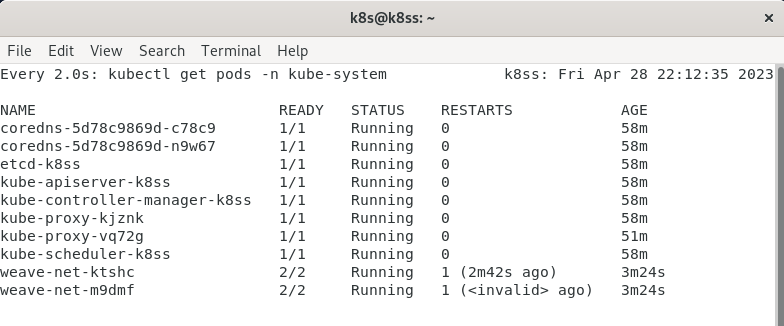
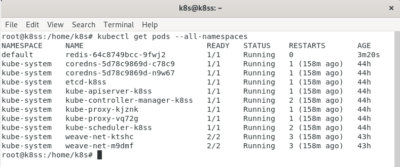

# Домашнее задание к занятию «Kubernetes. Часть 2»

### [](https://github.com/netology-code/sdvps-homeworks/blob/main/6-06.md#%D0%BE%D1%84%D0%BE%D1%80%D0%BC%D0%BB%D0%B5%D0%BD%D0%B8%D0%B5-%D0%B4%D0%BE%D0%BC%D0%B0%D1%88%D0%BD%D0%B5%D0%B3%D0%BE-%D0%B7%D0%B0%D0%B4%D0%B0%D0%BD%D0%B8%D1%8F)Оформление домашнего задания

1.  Домашнее задание выполните в [Google Docs](https://docs.google.com/) и отправьте на проверку ссылку на ваш документ в личном кабинете.
2.  В названии файла укажите номер лекции и фамилию студента. Пример названия: 6.6. Kubernetes. Часть 2 — Александр Александров.
3.  Перед отправкой проверьте, что доступ для просмотра открыт всем, у кого есть ссылка. Если нужно прикрепить дополнительные ссылки, добавьте их в свой Google Docs.

Любые вопросы по решению задач задавайте в чате учебной группы.

---

## [](https://github.com/netology-code/sdvps-homeworks/blob/main/6-06.md#%D0%B2%D0%B0%D0%B6%D0%BD%D0%BE)Важно

Перед отправкой работы на проверку удаляйте неиспользуемые ресурсы. Это нужно, чтобы предупредить неконтролируемый расход средств, полученных после использования промокода.

Рекомендации [по ссылке](https://github.com/netology-code/sdvps-homeworks/tree/main/recommend).

---

### [](https://github.com/netology-code/sdvps-homeworks/blob/main/6-06.md#%D0%B7%D0%B0%D0%B4%D0%B0%D0%BD%D0%B8%D0%B5-1)Задание 1

**Выполните действия:**

1.  Создайте свой кластер с помощью kubeadm.
2.  Установите любой понравившийся CNI плагин.
3.  Добейтесь стабильной работы кластера.

В качестве ответа пришлите скриншот результата выполнения команды `kubectl get po -n kube-system`.

ответ:

---

### [](https://github.com/netology-code/sdvps-homeworks/blob/main/6-06.md#%D0%B7%D0%B0%D0%B4%D0%B0%D0%BD%D0%B8%D0%B5-2)Задание 2

Есть файл с деплоем:

---
apiVersion: apps/v1
kind: Deployment
metadata:
  name: redis
spec:
  selector:
    matchLabels:
      app: redis
  replicas: 1
  template:
    metadata:
      labels:
        app: redis
    spec:
      containers:
      - name: master
        image: bitnami/redis
        env:
         - name: REDIS_PASSWORD
           value: password123
        ports:
        - containerPort: 6379

**Выполните действия:**

1.  Создайте Helm Charts.
2.  Добавьте в него сервис.
3.  Вынесите все нужные, на ваш взгляд, параметры в `values.yaml`.
4.  Запустите чарт в своём кластере и добейтесь его стабильной работы.

В качестве ответа пришлите вывод команды `helm get manifest <имя_релиза>`.

ответ: 
```
---
# Source: redis/templates/serviceaccount.yaml
apiVersion: v1
kind: ServiceAccount
metadata:
  name: redis
  labels:
    helm.sh/chart: redis-0.1.0
    app.kubernetes.io/name: redis
    app.kubernetes.io/instance: redis
    app.kubernetes.io/managed-by: Helm
---
# Source: redis/templates/deployment.yaml
apiVersion: apps/v1
kind: Deployment
metadata:
  name: redis
spec:
  selector:
    matchLabels:
      app: redis
  replicas: 1
  template:
    metadata:
      labels:
        app: redis
    spec:
      containers:
      - name: master
        image: bitnami/redis
        env:
        - name: REDIS_PASSWORD
          value: password12
        environment:
          - ALLOW_EMPTY_PASSWORD=yes           
        ports:
        - containerPort: 6379
---
# Source: redis/templates/service.yaml
apiVersion: apps/v1
kind: Deployment
metadata:
  name: redis
  labels:
    app: redis
spec:
  replicas: 1
  selector:
    matchLabels:
      app: redis
  template:
    metadata:
      labels:
        app: redis
    spec:
      containers:
        - name: redis
          image: "bitnami/redis:latest"
          environment:
            - ALLOW_EMPTY_PASSWORD=yes
          ports:
            - containerPort: 6379


```
---

## [](https://github.com/netology-code/sdvps-homeworks/blob/main/6-06.md#%D0%B4%D0%BE%D0%BF%D0%BE%D0%BB%D0%BD%D0%B8%D1%82%D0%B5%D0%BB%D1%8C%D0%BD%D1%8B%D0%B5-%D0%B7%D0%B0%D0%B4%D0%B0%D0%BD%D0%B8%D1%8F-%D1%81%D0%BE-%D0%B7%D0%B2%D1%91%D0%B7%D0%B4%D0%BE%D1%87%D0%BA%D0%BE%D0%B9)Дополнительные задания* (со звёздочкой)

Их выполнение необязательное и не влияет на получение зачёта по домашнему заданию. Можете их решить, если хотите лучше разобраться в материале.

---

### [](https://github.com/netology-code/sdvps-homeworks/blob/main/6-06.md#%D0%B7%D0%B0%D0%B4%D0%B0%D0%BD%D0%B8%D0%B5-3)Задание 3*

1.  Изучите [документацию](https://kubernetes.io/docs/concepts/storage/volumes/#hostpath) по подключению volume типа hostPath.
2.  Дополните деплоймент в чарте подключением этого volume.
3.  Запишите что-нибудь в файл на сервере, подключившись к поду с помощью `kubectl exec`, и проверьте правильность подключения volume.

В качестве ответа пришлите получившийся yaml-файл.

Ответ:  вроде сделал по инструкции но папка не прокидывается(((
```

# Source: redis/templates/deployment.yaml
apiVersion: apps/v1
kind: Deployment
metadata:
  name: redis
spec:
  selector:
    matchLabels:
      app: redis
  replicas: 1
  template:
    metadata:
      labels:
        app: redis
    spec:
      containers:
      - name: master
        image: bitnami/redis
        env:
        - name: REDIS_PASSWORD
          value: password12
        environment:
          - ALLOW_EMPTY_PASSWORD=yes           
        ports:
        - containerPort: 6379
        volumeMounts:
        - mountPath: /var/local/mydir
          name: 1
        volumes:
        - name: 1
          hostPath:
      # Ensure the file directory is created.
            path: /var/local/mydir
            type: DirectoryOrCreate
---
# Source: redis/templates/service.yaml
apiVersion: apps/v1
kind: Deployment
metadata:
  name: redis
  labels:
    app: redis
spec:
  replicas: 1
  selector:
    matchLabels:
      app: redis
  template:
    metadata:
      labels:
        app: redis
    spec:
      containers:
        - name: redis
          image: "bitnami/redis:latest"
          env:
          - name: REDIS_PASSWORD
            value: password12
          environment:
          - ALLOW_EMPTY_PASSWORD=yes
          ports:
            - containerPort: 6379


```