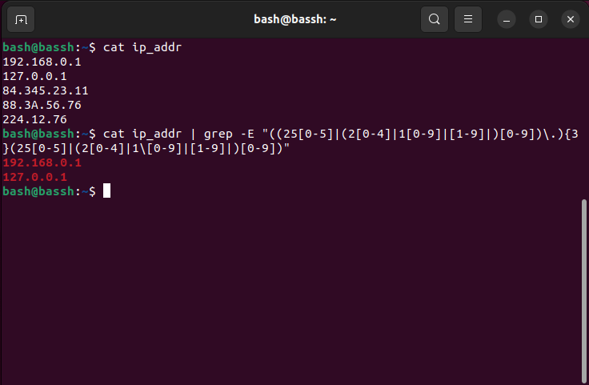
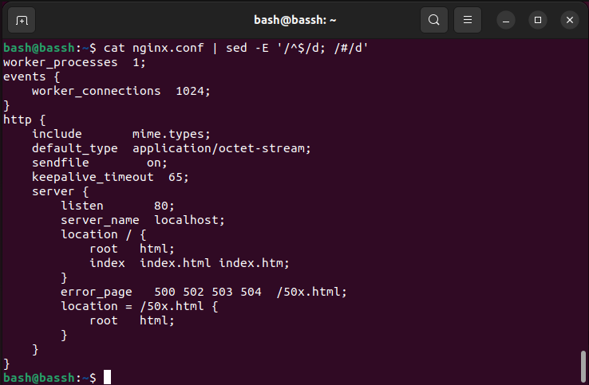
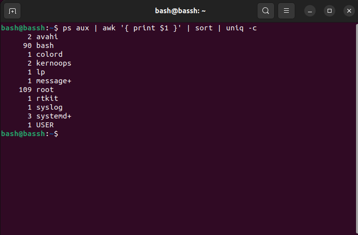
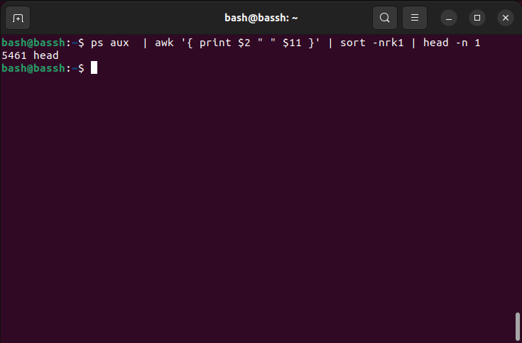
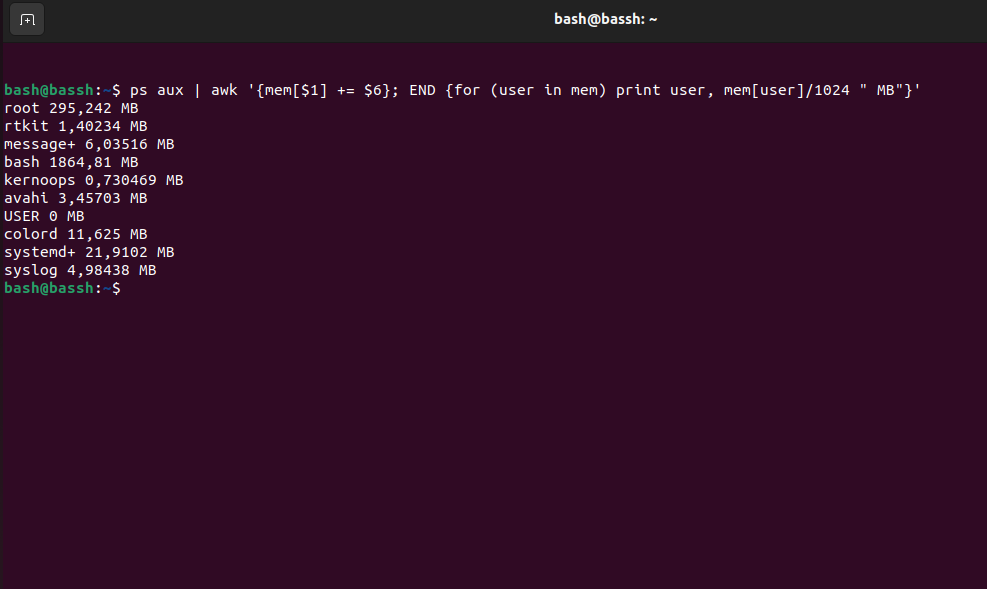
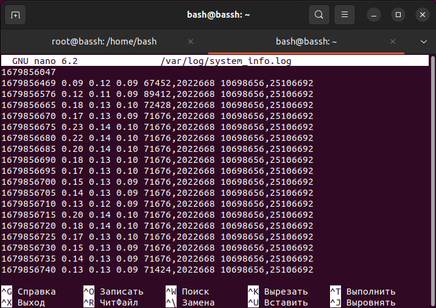
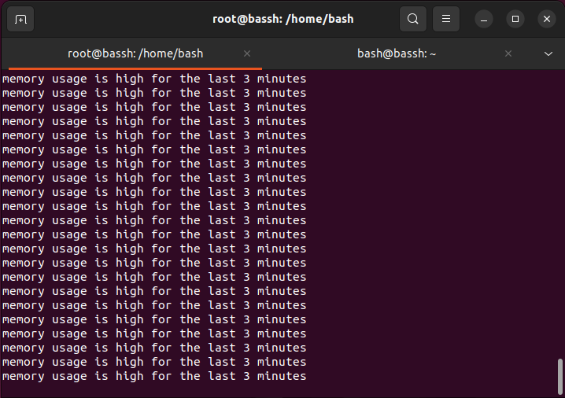

# Домашнее задание к занятию "Regexp и его использование для синтаксического анализа"

### [](https://github.com/netology-code/snet-homeworks/blob/snet-18/5-03.md#%D1%86%D0%B5%D0%BB%D1%8C-%D0%B7%D0%B0%D0%B4%D0%B0%D0%BD%D0%B8%D1%8F)Цель задания

В результате выполнения этого задания вы научитесь использовать:

1.  Регулярные выражения для фильтрации вывода;
2.  Утилиту sed для работы с конфигурационными файлами;
3.  Утилиту awk для анализа информации.

---

### [](https://github.com/netology-code/snet-homeworks/blob/snet-18/5-03.md#%D1%87%D0%B5%D0%BA%D0%BB%D0%B8%D1%81%D1%82-%D0%B3%D0%BE%D1%82%D0%BE%D0%B2%D0%BD%D0%BE%D1%81%D1%82%D0%B8-%D0%BA-%D0%B4%D0%BE%D0%BC%D0%B0%D1%88%D0%BD%D0%B5%D0%BC%D1%83-%D0%B7%D0%B0%D0%B4%D0%B0%D0%BD%D0%B8%D1%8E)Чеклист готовности к домашнему заданию

1.  Установлена операционная система Ubuntu на виртуальную машину или локально и имеется доступ к терминалу (удаленный или из графической оболочки)
2.  Произведена работа с файлами, рассматриваемыми на лекции, которые находятся [ссылке](https://github.com/netology-code/snet-homeworks/blob/snet-18/5-03)

### [](https://github.com/netology-code/snet-homeworks/blob/snet-18/5-03.md#%D0%B8%D0%BD%D1%81%D1%82%D1%80%D1%83%D0%BA%D1%86%D0%B8%D1%8F-%D0%BA-%D0%B7%D0%B0%D0%B4%D0%B0%D0%BD%D0%B8%D1%8E)Инструкция к заданию

1.  Сделайте копию [Шаблона для домашнего задания](https://docs.google.com/document/d/1youKpKm_JrC0UzDyUslIZW2E2bIv5OVlm_TQDvH5Pvs/edit) себе на Google Диск.
2.  В названии файла введите корректное название лекции и вашу фамилию и имя.
3.  Зайдите в “Настройки доступа” и выберите доступ “Просматривать могут все в Интернете, у кого есть ссылка”. Ссылка на инструкцию [Как предоставить доступ к файлам и папкам на Google Диске](https://support.google.com/docs/answer/2494822?hl=ru&co=GENIE.Platform%3DDesktop)
4.  Скопируйте текст задания в свой Google Документ.
5.  Выполните домашнее задание, запишите ответы и приложите необходимые скриншоты и код в свой Google Документ.
6.  Для проверки домашнего задания преподавателем отправьте ссылку на ваш Google документ в личном кабинете.
7.  Любые вопросы по решению задач задавайте в чате учебной группы.

---

### [](https://github.com/netology-code/snet-homeworks/blob/snet-18/5-03.md#%D0%B7%D0%B0%D0%B4%D0%B0%D0%BD%D0%B8%D0%B5-1)Задание 1.

Напишите регулярное выражение для проверки является ли строка `IPv4` адресом.

Для тестов можно использовать файл со следующим содержимым, фильтруя вывод с помощью команды `grep -E`:

```
192.168.0.1
127.0.0.1
84.345.23.11
88.3A.56.76
224.12.76
```

_Пришлите получившееся выражение в качестве ответа._
Ответ: 
```
^((25[0-5]|(2[0-4]|1[0-9]|[1-9]|)[0-9])\.){3}(25[0-5]|(2[0-4]|1\[0-9]|[1-9]|)[0-9])$
```

---

### [](https://github.com/netology-code/snet-homeworks/blob/snet-18/5-03.md#%D0%B7%D0%B0%D0%B4%D0%B0%D0%BD%D0%B8%D0%B5-2)Задание 2.

В Вашей конфигурации Nginx скопилось много неиспользуемых сегментов и становится сложно его читать.

Используя `sed` удалите все пустые строки и комментарии в конфигурации Nginx.

Попробуйте сделать это одним запуском.

Файл расположен по [ссылке](https://github.com/netology-code/snet-homeworks/blob/snet-18/5-03/nginx.conf)

_Пришлите получившуюся команду в качестве ответа_

Ответ:
```
cat nginx.conf | sed -E '/^$/d; /#/d'

```

---

### [](https://github.com/netology-code/snet-homeworks/blob/snet-18/5-03.md#%D0%B7%D0%B0%D0%B4%D0%B0%D0%BD%D0%B8%D0%B5-3)Задание 3.

Используя `awk` и `ps aux` соберите информацию о:

-   количестве процессов для каждого пользователя;
-   процессе с самым большим PID;
-   (дополнительное задание со звездочкой*) суммарном использовании памяти различными пользователями.

_Пришлите скриншоты со скриптами и демонстрацией их работы_

Ответ:
```
ps aux | awk '{ print $1 }' | sort | uniq -c

```

```
ps aux  | awk '{ print $2 " " $11 }' | sort -nrk1 | head -n 1
```


```
ps aux | awk '{mem[$1] += $6}; END {for (user in mem) print user, mem[user]/1024 " MB"}'
```



## [](https://github.com/netology-code/snet-homeworks/blob/snet-18/5-03.md#%D0%B4%D0%BE%D0%BF%D0%BE%D0%BB%D0%BD%D0%B8%D1%82%D0%B5%D0%BB%D1%8C%D0%BD%D1%8B%D0%B5-%D0%B7%D0%B0%D0%B4%D0%B0%D0%BD%D0%B8%D1%8F-%D1%81%D0%BE-%D0%B7%D0%B2%D0%B5%D0%B7%D0%B4%D0%BE%D1%87%D0%BA%D0%BE%D0%B9)Дополнительные задания (со звездочкой*)

Эти задания дополнительные (не обязательные к выполнению) и никак не повлияют на получение вами зачета по этому домашнему заданию. Вы можете их выполнить, если хотите глубже и/или шире разобраться в материале.

### [](https://github.com/netology-code/snet-homeworks/blob/snet-18/5-03.md#%D0%B7%D0%B0%D0%B4%D0%B0%D0%BD%D0%B8%D0%B5-4)Задание 4.

Напишите bash-скрипт который собирает информацию о системе и пишет ее в лог каждые 5 секунд.

Используемые параметры:

-   loadavg[1,5,15] средний показатель загрузки ЦПУ за последние 1 5 и 15 минут. _Примечание:_ хранится в `/proc/loadavg`. 
-   memfree количество свободной оперативной памяти в байтах. _Примечание:_ используем утилиту `free`.
-   memtotal количество всей оперативной памяти в байтах. _Примечание:_ используем утилиту `free`.
-   diskfree свободное место на диске подключенного к /. _Примечание:_ используем утилиту `df`.
-   disktotal общий объем диска подключенного к /. _Примечание:_ используем утилиту `df`.

_**Формат записи:**_ `timestamp loadavg1 loadavg5 loadavg15 memfree memtotal diskfree disktotal`

Пособирайте данные в течении 5-10 минут.

Анализируя этот лог с помощью `awk` напишите скрипт проверки состояния системы с заданными условиями:

-   `loadavg1 < 1` в течении последних 2 минут;
-   `memfree / memtotal < 60%` в течении последних 3 минут;
-   `diskfree / disktotal < 60%` в течении последних 5 минут.

Скрипт должен возвращать 0 код ответа, если все условия выполняются, и любой другой в случае невыполнения.

В консоль также необходимо выводить, какое именно из условий не выполняется.

_Пришлите получившиеся скрипты в качестве ответа._

Ответ: 
```
function check(){

 if [ $(awk -v time=$(date --date='2 minutes ago' '+%s') '$1 >= time && $2 < 1' /var/log/system_info.log | wc -l) -eq 0 ]; then

   echo "loadavg1 is high for the last 2 minutes"

   return 1

 fi

 if [ $(awk -v time=$(date --date='3 minutes ago' '+%s') '{if ($1 >= time) {if ($5/$4 < o.6) {print $0}}}' /var/log/system_info.log | wc -l) -eq 0 ]; then

   echo "memory usage is high for the last 3 minutes"

   return 2

 fi

 if [ $(awk -v time=$(date --date='5 minutes ago' '+%s') '{if ($1 >=time) {if ($7/$6 <0.6) {print $0}}}' /var/log/system_info.log | wc -l) -eq 0 ]; then

   echo "disk usage is high for the last 5 minutes"

   return 3

 fi


 return 0

}

while true

do

 timestamp=$(date '+%s')

 loadavg=$(cat /proc/loadavg | awk '{ print $1" "$2" "$3}')

 mem=$(free | awk '{ print $4","$2 }' | awk NR==2)

 disk=$(df / | awk '{ print $4","$2 }' | awk NR==2)

 echo "$timestamp $loadavg $mem $disk" >> /var/log/system_info.log


  check


  if [ $? -eq 0 ]; then

    echo "System is healthy"

    exit 0

  fi


  sleep 5


done

```


---

### [](https://github.com/netology-code/snet-homeworks/blob/snet-18/5-03.md#%D0%BF%D1%80%D0%B0%D0%B2%D0%B8%D0%BB%D0%B0-%D0%BF%D1%80%D0%B8%D0%B5%D0%BC%D0%B0-%D1%80%D0%B0%D0%B1%D0%BE%D1%82%D1%8B)Правила приема работы

-   В личном кабинете отправлена ссылка на ваш Google документ, в котором прописан код каждого скрипта и скриншоты, демонстрирующие корректную работу скрипта
-   В документе настроены права доступа “Просматривать могут все в Интернете, у кого есть ссылка”
-   Название документа содержит название лекции и ваши фамилию и имя

---

### [](https://github.com/netology-code/snet-homeworks/blob/snet-18/5-03.md#%D0%BA%D1%80%D0%B8%D1%82%D0%B5%D1%80%D0%B8%D0%B8-%D0%BE%D1%86%D0%B5%D0%BD%D0%BA%D0%B8)Критерии оценки

Зачет - выполнены все задания, приложен скрипт или команда, приложены соответствующие скриншоты, в выполненных заданиях нет противоречий и нарушения логики

На доработку - задание выполнено частично или не выполнено, в логике выполнения заданий есть противоречия, существенные недостатки.


ssh telnet
pwd 

сбертам сбер портал

хабаровск
фиксирует ошибки, звонит, по инсттр помог, запрос на поддержку, смотреть что не так, кутузовский 32, 5-2 на усмотрение руководство, самостоятельно в бой не посылают, лицо обучающее, погружают в процессы. Пао сбербанка, 1 в год на 2 курса вендора, linux.
виртуальная школа. 
