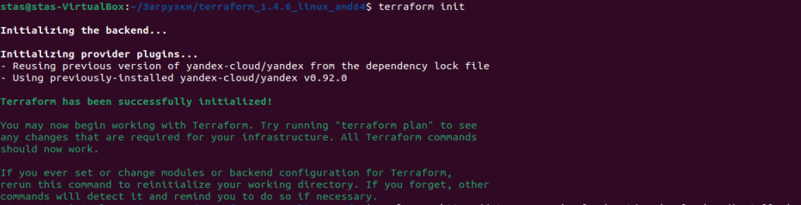
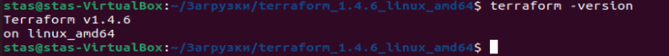

# Домашнее задание к занятию «Terraform»

### Оформление домашнего задания

1. Домашнее задание выполните в [Google Docs](https://docs.google.com/) и отправьте на проверку ссылку на ваш документ в личном кабинете.
2. В названии файла укажите номер лекции и фамилию студента. Пример названия: 7.2. Terraform — Александр Александров.
3. Перед отправкой проверьте, что доступ для просмотра открыт всем, у кого есть ссылка. Если нужно прикрепить дополнительные ссылки, добавьте их в свой Google Docs.

Любые вопросы по решению задач задавайте в чате учебной группы.

---

### Задание 1

**Ответьте на вопрос в свободной форме.**

Опишите виды подхода к IaC:

- функциональный;
- процедурный;
- интеллектуальный.

Ответ: Декларативное определение дает инструкции, как должна выглядеть система после завершения процесса настройки. Процедурное определение представляет собой пошаговые инструкции о том, что система должна сделать для достижения желаемой конфигурации. Интеллектуальный описывает, почему инфраструктура должна быть так сконфигурирована

---

### Задание 2

**Ответьте на вопрос в свободной форме.**

Как вы считаете, в чём преимущество применения Terraform?

Ответ: 
- простота и скорость развертывания - возможность развертывания инфраструктуры во мнжестве сред простым выполнением определенного сценария;
- согласованность настроек - стандартизация процесса сборки и управления инфраструктурой с тем, чтобы снизить возможность любых ошибок и отклонений;
- минимизация риска - автоматизация всего процесса развертывания инфраструктуры служит некой формой документирования, что позволяет подстраховаться, если работники с относящимися к разработке инфраструктуры знаниями покидают компанию;
- увеличение эффективности в разработке ПО - автоматизация развертывания инфраструктуры и управления ею позволяет программистам и  
    тестировщикам сфокусироваться на разработке и тестировании ПО;
- экономия стоимости - автоматизация развёртывания инфраструктуры позволяет инженерам перестать выполнять работу вручную и начинать тратить больше времени на осуществление дополнительных задач;

---

### Задание 3

**Ответьте на вопрос в свободной форме.**

Какие минусы можно выделить при использовании IaC?

Ответ: 

- логика и соглашения - разработчикам необходимо понимать IaC скрипты независимо от того, написаны ли они на языке HCL или на обычном Python или Ruby. Суть в том, что необходимо не столько разбираться в множестве разных языков, сколько понимать и применять общепринятую логику и соглашения;
    
- обслуживание и возможность отслеживания - обслуживание инфраструктуры IaC само по себе может стать проблемой при достижении определенного масштаба (к примеру, если число разработчиков переваливает за сотню). Когда IaC широко используется в организации с несколькими командами, отслеживание и управление версиями конфигураций не так просты, как может показаться на первый взгляд;
    
- управление доступом на основе ролей (RBAC) - основываясь на нем, управление доступом тоже становится сложной задачей. Установка ролей и разрешений в различных частях организации, которые внезапно получают доступ к скриптам для быстрого развертывания кластеров и сред, может оказаться довольно сложной задачей;
    
- запаздывание фич - инструменты IaC, не зависящие от поставщика (например, Terraform), часто запаздывают с фичами в сравнении с продуктами, привязанными к конкретному поставщику. Это связано с тем, что поставщикам инструментов необходимо обновлять провайдеров, чтобы полностью охватить новые облачные фичи, выпускаемые постоянно растущими темпами

---

### Задание 4

**Выполните действия и приложите скриншоты запуска команд.**

Установите Terraform на компьютерную систему (виртуальную или хостовую), используя лекцию или [инструкцию](https://learn.hashicorp.com/tutorials/terraform/install-cli).

В связи с недоступностью ресурсов для загрузки Terraform на территории РФ, вы можете воспользоваться VPN или использовать зеркало YandexCloud.

- [Документация по провайдерам Terraform в зеркале YandexCloud](https://registry.tfpla.net/browse/providers)
- [Зеркало YandexCloud для загрузки Terraform](https://hashicorp-releases.yandexcloud.net/terraform/)
- [Инструкция по настройке провайдера](https://cloud.yandex.ru/docs/tutorials/infrastructure-management/terraform-quickstart#configure-terraform)

Ответ:

---

## Дополнительные задания* (со звёздочкой)

Их выполнение необязательное и не влияет на получение зачёта по домашнему заданию. Можете их решить, если хотите лучше разобраться в материале или, если хотите глубже и/или шире разобраться в материале.

---

### Задание 5*

**Ответьте на вопрос в свободной форме.**

Перечислите основные функции, которые могут использоваться в Terraform.