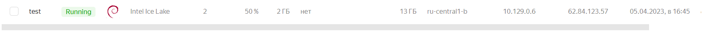
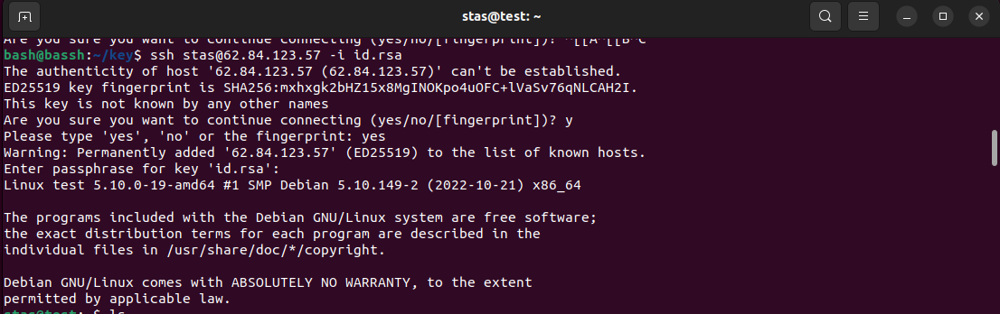

# Домашнее задание к занятию «Виртуализация и облачные решения: AWS, GCP, Yandex Cloud, OpenStack»

### Оформление домашнего задания

1.  Домашнее задание выполните в [Google Docs](https://docs.google.com/) и отправьте на проверку ссылку на ваш документ в личном кабинете.
2.  В названии файла укажите номер лекции и фамилию студента. Пример названия: 6.1. Виртуализация — Александр Александров.
3.  Перед отправкой проверьте, что доступ для просмотра открыт всем, у кого есть ссылка. Если нужно прикрепить дополнительные ссылки, добавьте их в свой Google Docs.

Любые вопросы по решению задач задавайте в чате учебной группы.

---

## Важно

Перед отправкой работы на проверку удаляйте неиспользуемые ресурсы. Это нужно, чтобы предупредить неконтролируемый расход средств, полученных после использования промокода.

Рекомендации [по ссылке](https://github.com/netology-code/sdvps-homeworks/tree/main/recommend).

---

### Задание 1

**Ответьте на вопрос в свободной форме.**

Чем частное облако отличается от общедоступного, публичного и гибридного?

Ответ: Частное облако в отличается тем что доступ к нему имеют только определенные пользователи.

---

### Задание 2

Что обозначают: IaaS, PaaS, SaaS, CaaS, DRaaS, BaaS, DBaaS, MaaS, DaaS, NaaS, STaaS? Напишите примеры их использования.

Ответ:
IaaS - модель обслуживания в  
облаке, в которой потребителям предоставляются по подписке  
виртуальные серверы с заданной вычислительной мощностью и  
операционной системой. 
Например: Amazon EC2

PaaS - модель предоставления облачных  
вычислений, при которой потребитель получает доступ к  
использованию информационно-технологических платформ:  
операционных систем, систем управления базами данных и  
другим программам.
Например: VMWare Cloud Foundry

SaaS - одна из форм облачных вычислений, при  
которой подписчикам предоставляется готовое прикладное  
программное обеспечение, полностью обслуживаемое  
провайдером.
Например: GoogleDoc

CaaS - с помощью услуги CaaS клиенты могут загружать, организовывать, запускать, останавливать контейнеры, используя средства API или веб-портал управления. Как и в случае с большинством облачных сервисов, клиенты вносят плату за использованное количество ресурсов в рамках выбранной услуги.  

DRaaS - В рамках услуги DRaaS провайдер обеспечит репликацию серверов компании на удаленную площадку с возможностью развертывания в случае аварии. Другими словами, в облаке будет создана копия серверов компании. Если инфраструктура клиента перестанет работать, копии в облаке можно запустить и за считанные минуты продолжить работу.

BaaS (банк как услуга) – это предоставление банком своей инфраструктуры в пользование компаниям. Это похоже на сдачу в аренду — когда бизнес берёт у банка нужные ему финансовые инструменты и встраивает их в свою информационную систему.

 DBaaS — система управления базами данных, установленная поверх облачной инфраструктуры (IaaS). Это дает возможность обращаться к базе данных напрямую и масштабировать ее под нагрузкой «на лету», что редко возможно в традиционных базах данных.

 MaaS - позволяет отслеживать ключевые параметры инфраструктуры и программного обеспечения, которые вы задаёте через центральную панель управления в веб-интерфейсе онлайн. Пока ещё новое звено этой большой облачной головоломки, но уже считается неотъемлемой частью будущего IT-отрасли и обработки Big Data. Помогает снизить риски непредвиденных расходов и оптимизировать работу предприятия.

 DaaS - клиенты получают полностью готовое к работе («под ключ») стандартизированное виртуальное рабочее место, которое каждый пользователь имеет возможность дополнительно настраивать под свои задачи. Таким образом, пользователь получает доступ не к отдельной программе, а к необходимому для полноценной работы программному комплексу.

NaaS - описывает услуги для сетевого транспортного подключения. **naas** предполагает оптимизацию распределения ресурсов путем рассмотрения сетевых и вычислительных ресурсов как единого целого.

STaaS - это услуга «хранение как сервис», которая предполагает использование дискового пространства по требованию. Услуга может быть полезна кому угодно, начиная от корпоративного сектора, заканчивая обывателем, у которого попросту заканчивается свободное место на жестком диске.  

---

### Задание 3

**Ответьте на вопрос в свободной форме.**

Напишите, какой вид сервиса предоставляется пользователю в ситуациях:

1.  Всеми процессами управляет провайдер.
2.  Вы управляете приложением и данными, остальным управляет провайдер.
3.  Вы управляете операционной системой, средой исполнения, данными, приложениями, остальными управляет провайдер.
4.  Вы управляете сетью, хранилищами, серверами, виртуализацией, операционной системой, средой исполнения, данными, приложениями.
Ответ: SaaS, PaaS, IaaS, Физическая инфроструктура.
---

### Задание 4

Вы работаете ИТ-специалистом в своей компании. Перед вами встал вопрос: покупать физический сервер или арендовать облачный сервис от [Yandex Cloud](https://cloud.yandex.ru/).

Выполните действия и приложите скриншоты по каждому этапу:

1.  Создать платёжный аккаунт:

-   зайти в консоль;
-   выбрать меню биллинг;
-   зарегистрировать аккаунт.

1.  После регистрации выбрать меню в консоли Computer cloud.
2.  Приступить к созданию виртуальной машины.

**Ответьте на вопросы в свободной форме:**

1.  Какие ОС можно выбрать? 
2.  Какие параметры сервера можно выбрать?
3.  Какие компоненты мониторинга можно создать?
4.  Какие системы безопасности предусмотрены?
5.  Как меняется цена от выбранных характеристик? Приведите пример самой дорогой и самой дешёвой конфигурации.
Ответ: 
1. Доступно 49 различных операционных систем.
2. Можно выбрать платформу (Тип физического процессора) Указать количество ядер. Установить гарантию производительности. Объем ОЗУ. Размер и тип дисков. 
3. Load testing tool, zabbix.
4. Open vpn, Kaspersky, межсетевой экран cisco и др.
5. Самая дешёвая получилась 541,56р в месяц насчет самой дорогой я потолок не нашел так как диски можно маштабировать очень долго.

---

## Дополнительные задания* (со звёздочкой)

Их выполнение необязательное и не влияет на получение зачёта по домашнему заданию. Можете их решить, если хотите лучше разобраться в материале.

---

### Задание 5*

Выполните действия и приложите скриншот:

1.  Создайте виртуальную машину на Yandex Cloud.
2.  Создайте сервисный аккаунт.
3.  Отсканируйте SSH-ключ.
4.  Придумайте логин.
5.  Подключитесь к облаку через SSH.

