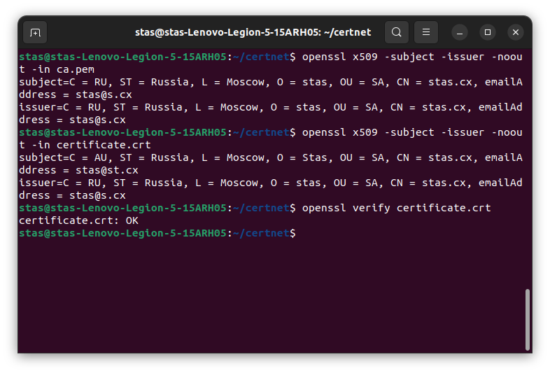

# Домашнее задание к занятию "4.7 Высокоуровневые протоколы"

**

**Домашнее задание выполните в [Google Docs](https://docs.google.com/) и отправьте в личном кабинете на проверку ссылку на ваш документ.**

Название файла должно содержать номер лекции и фамилию студента. Пример названия: "4.7 Высокоуровневые протоколы - Александр Дивеев"

Перед тем как выслать ссылку, убедитесь, что ее содержимое не является приватным (открыто на просмотр всем, у кого есть ссылка). Если необходимо прикрепить дополнительные ссылки, просто добавьте их в свой Google Docs.

Любые вопросы по решению задач задавайте в чате учебной группы.

---

### [](https://github.com/netology-code/snet-homeworks/blob/main/4-07.md#%D0%B7%D0%B0%D0%B4%D0%B0%D0%BD%D0%B8%D0%B5-1)Задание 1.

Какие порты используются протоколами:

-   Telnet;
-   SSH;
-   FTP;
-   SNMP;

_Приведите ответ в виде списка портов._

Ответ:
Telnet 23, 
SSH 22, 
FTP 20 21, 
SNMP 161 162.

---

### [](https://github.com/netology-code/snet-homeworks/blob/main/4-07.md#%D0%B7%D0%B0%D0%B4%D0%B0%D0%BD%D0%B8%D0%B5-2)Задание 2.

Какой по счету уровень модели OSI называется прикладным (`application layer`)?

_Зашифруйте ответ с помощью ключа: {5, 21}._

Ответ: 7

---

### [](https://github.com/netology-code/snet-homeworks/blob/main/4-07.md#%D0%B7%D0%B0%D0%B4%D0%B0%D0%BD%D0%B8%D0%B5-3)Задание 3.

Создайте свой корневой сертификат, добавьте его в систему.

Затем подпишите им свой сертификат.

**1. Генерируем ключ**

```
- openssl genrsa -out ca.key 2048
```

**2. Генерируем корневой сертификат. Поля в сертификате указываем любые.**

```
- openssl req -x509 -new -nodes -key ca.key -sha256 -days 720 -out ca.pem
```

**3. Сразу же сделаем сертификат в форме `crt`**

```
- openssl x509 -in ca.pem -inform PEM -out ca.crt
```

**4. Далее установим сертификат в систему. Ниже пример для `Ubuntu`/`Debian` систем**

```
- sudo cp ca.crt /usr/local/share/ca-certificates/myca.crt && sudo update-ca-certificates
```

**5. Приступим к выпуску самого сертификата:**

**5.1. Генерируем ключи**

```
- openssl genrsa -out certificate.key 2048
```

**5.2. На основе ключа создаем `CSR`**

_Обратите внимание, что subject конечного сертификата **не должен** совпадать с subject корневого. Хотя бы в одном поле нужно указать отличающееся значение, например в common Name или email. В противном случае конечный сертификат не будет верифицироваться, поскольку будет считаться самоподписным._

```
- openssl req -new -key certificate.key -out certificate.csr
```

**5.3. Подписываем `CSR` нашим корневым сертификатом. Тем самым создаем конечный сертификат.**

```
- openssl x509 -req -in certificate.csr -CA ca.pem -CAkey ca.key -CAcreateserial -out certificate.crt -days 360 -sha256
```

**6. Проверяем валидность сертификата**

_Эта проверка должна вернуть `OK`. Если вы видите `failed`, значит, где-то допущена ошибка._

```
- openssl verify certificate.crt
```

_В качестве ответа приложите снимки экрана с выводом информации о сертификатах и результатом верификации:_

```
openssl x509 -subject -issuer -noout -in ca.pem
openssl x509 -subject -issuer -noout -in certificate.crt
openssl verify certificate.crt
```

Ответ: 