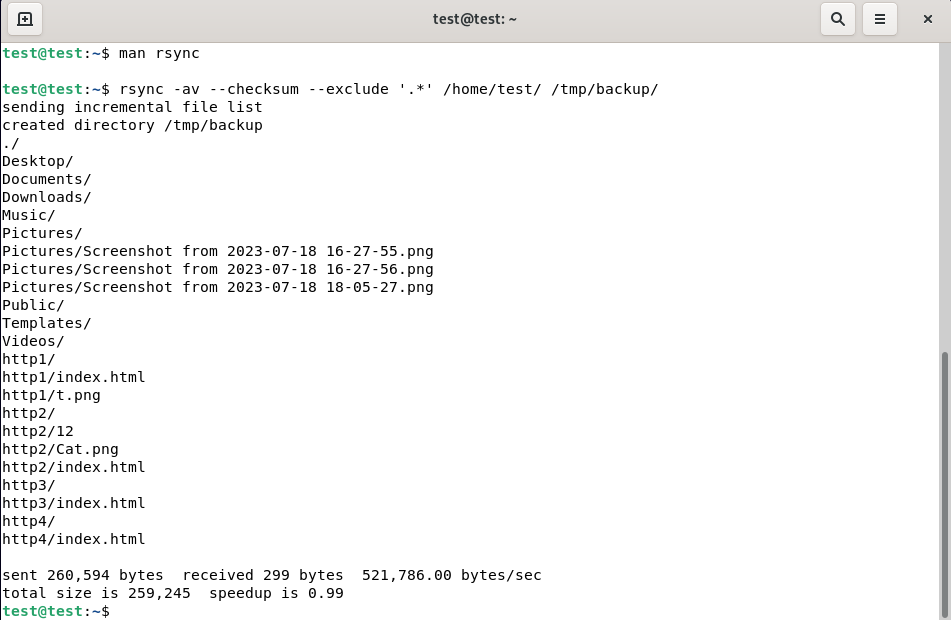
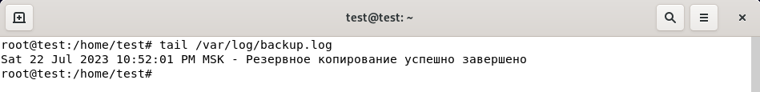
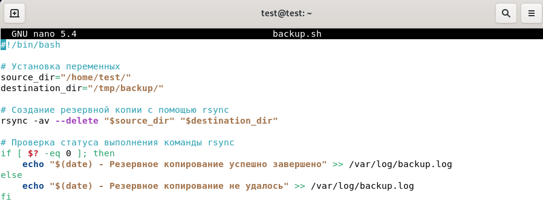
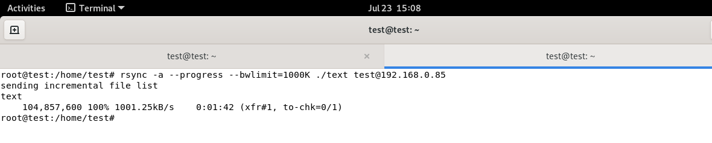

# Домашнее задание к занятию 3 «Резервное копирование»

### Цель задания
В результате выполнения этого задания вы научитесь:
1. Настраивать регулярные задачи на резервное копирование (полная зеркальная копия)
2. Настраивать инкрементное резервное копирование с помощью rsync

------

### Чеклист готовности к домашнему заданию

1. Установлена операционная система Ubuntu на виртуальную машину и имеется доступ к терминалу
2. Сделан клон этой виртуальной машины с другим IP адресом


------

### Инструкция по выполнению домашнего задания

1. Сделайте fork [репозитория c шаблоном решения](https://github.com/netology-code/sys-pattern-homework) к себе в Github и переименуйте его по названию или номеру занятия, например, https://github.com/имя-вашего-репозитория/gitlab-hw или https://github.com/имя-вашего-репозитория/8-03-hw).
2. Выполните клонирование этого репозитория к себе на ПК с помощью команды git clone.
3. Выполните домашнее задание и заполните у себя локально этот файл README.md:
   - впишите вверху название занятия и ваши фамилию и имя;
   - в каждом задании добавьте решение в требуемом виде: текст/код/скриншоты/ссылка;
   - для корректного добавления скриншотов воспользуйтесь инструкцией [«Как вставить скриншот в шаблон с решением»](https://github.com/netology-code/sys-pattern-homework/blob/main/screen-instruction.md);
   - при оформлении используйте возможности языка разметки md. Коротко об этом можно посмотреть в [инструкции по MarkDown](https://github.com/netology-code/sys-pattern-homework/blob/main/md-instruction.md).
4. После завершения работы над домашним заданием сделайте коммит (git commit -m "comment") и отправьте его на Github (git push origin).
5. Для проверки домашнего задания преподавателем в личном кабинете прикрепите и отправьте ссылку на решение в виде md-файла в вашем Github.
6. Любые вопросы задавайте в чате учебной группы и/или в разделе «Вопросы по заданию» в личном кабинете.


------


### Задание 1
- Составьте команду rsync, которая позволяет создавать зеркальную копию домашней директории пользователя в директорию `/tmp/backup`
- Необходимо исключить из синхронизации все директории, начинающиеся с точки (скрытые)
- Необходимо сделать так, чтобы rsync подсчитывал хэш-суммы для всех файлов, даже если их время модификации и размер идентичны в источнике и приемнике.
- На проверку направить скриншот с командой и результатом ее выполнения

Ответ:



### Задание 2
- Написать скрипт и настроить задачу на регулярное резервное копирование домашней директории пользователя с помощью rsync и cron.
- Резервная копия должна быть полностью зеркальной
- Резервная копия должна создаваться раз в день, в системном логе должна появляться запись об успешном или неуспешном выполнении операции
- Резервная копия размещается локально, в директории `/tmp/backup`
- На проверку направить файл crontab и скриншот с результатом работы утилиты.

Ответ:
```corntab 
52 22 * * * /home/test/backup.sh
```




---

## Задания со звёздочкой*
Эти задания дополнительные. Их можно не выполнять. На зачёт это не повлияет. Вы можете их выполнить, если хотите глубже разобраться в материале.

---

### Задание 3*
- Настройте ограничение на используемую пропускную способность rsync до 1 Мбит/c
- Проверьте настройку, синхронизируя большой файл между двумя серверами
- На проверку направьте команду и результат ее выполнения в виде скриншота

Ответ:




### Задание 4*
- Напишите скрипт, который будет производить инкрементное резервное копирование домашней директории пользователя с помощью rsync на другой сервер
- Скрипт должен удалять старые резервные копии (сохранять только последние 5 штук)
- Напишите скрипт управления резервными копиями, в нем можно выбрать резервную копию и данные восстановятся к состоянию на момент создания данной резервной копии.
- На проверку направьте скрипт и скриншоты, демонстрирующие его работу в различных сценариях.

Ответ:

```            
#!/bin/bash

# Параметры скрипта
SOURCE_DIR="/home/test"
REMOTE_HOST="root@192.168.0.85"
REMOTE_DIR="/backup_server"
BACKUP_PREFIX="backup"
MAX_BACKUPS=5

# Функция для создания инкрементного бэкапа
create_backup() {
  new_backup_name="${BACKUP_PREFIX}_$(date +%Y-%m-%d_%H:%M:%S)"
  if ssh "$REMOTE_HOST" "ls -d $REMOTE_DIR/${BACKUP_PREFIX}*" >/dev/null 2>&1 ; then 
      latest_backup=$(ssh "$REMOTE_HOST" "ls $REMOTE_DIR/ | grep $BACKUP_PREFIX | tail -1")
      rsync -a --link-dest="$REMOTE_DIR/$latest_backup" --delete  "$SOURCE_DIR/" "$REMOTE_HOST:$REMOTE_DIR/$new_backup_name"
  else
      rsync -a --delete  "$SOURCE_DIR/" "$REMOTE_HOST:$REMOTE_DIR/$new_backup_name"
  fi
}

# Функция для удаления старых резервных копий
delete_old_backups() {
  # Получаем список всех резервных копий
  backups_list=$(ssh "$REMOTE_HOST" "ls $REMOTE_DIR/ | grep $BACKUP_PREFIX")

  # Проверяем количество резервных копий
  num_backups=$(echo "$backups_list" | wc -l)
  if [ "$num_backups" -gt "$MAX_BACKUPS" ]; then
    # Удаляем старые резервные копии
    num_to_delete=$((num_backups - MAX_BACKUPS))
    backups_to_delete=$(echo "$backups_list" | head -n $num_to_delete)
    for backup in $backups_to_delete; do
      ssh "$REMOTE_HOST" "rm -rf $REMOTE_DIR/$backup"
    done
  fi
}

# Функция для восстановления выбранной резервной копии
restore_backup() {
  selected_backup=$1
  rsync -a --delete "$REMOTE_HOST:$REMOTE_DIR/$selected_backup/" "$SOURCE_DIR"
}

if [[ "$1" == "-run" ]]; then
  create_backup
  delete_old_backups
  echo "Создана новая резервная копия $new_backup_name."
elif [[ "$1" == "-list" ]]; then
  backups_list=$(ssh "$REMOTE_HOST" "ls $REMOTE_DIR/ | grep $BACKUP_PREFIX")
  echo "Доступные резервные копии:"
  echo "$backups_list"

  read -p "Введите номер резервной копии для восстановления (0 для выхода): " selected_number
  if [[ ! "$selected_number" =~ ^[0-9]+$ || -z "$selected_number" ||  "$selected_number" -lt 0 || "$selected_number" -gt $(echo "$backups_list" | wc -l) ]]; then
    echo "Некорректное значение."
    exit 1
  elif [[ "$selected_number" -eq 0 ]]; then
    echo "Выход."
    exit 0
  fi

  selected_backup=$(echo "$backups_list" | sed -n "$selected_number"p)
  restore_backup "$selected_backup"
  echo "Восстановление из резервной копии $selected_backup завершено."

else
  echo "Неправильная команда. Доступны команды: backup.sh -list|-run"
  exit 1
fi
```

------

### Правила приема работы

1. Необходимо следовать инструкции по выполнению домашнего задания, используя для оформления репозиторий Github
2. В ответе необходимо прикладывать требуемые материалы - скриншоты, конфигурационные файлы, скрипты. Необходимые материалы для получения зачета указаны в каждом задании.


------

### Критерии оценки

- Зачет - выполнены все задания, ответы даны в развернутой форме, приложены требуемые скриншоты, конфигурационные файлы, скрипты. В выполненных заданиях нет противоречий и нарушения логики
- На доработку - задание выполнено частично или не выполнено, в логике выполнения заданий есть противоречия, существенные недостатки, приложены не все требуемые материалы.


