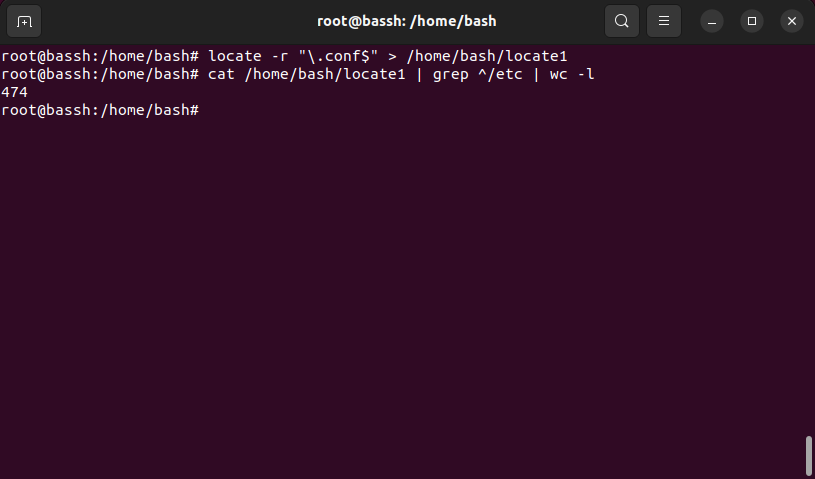
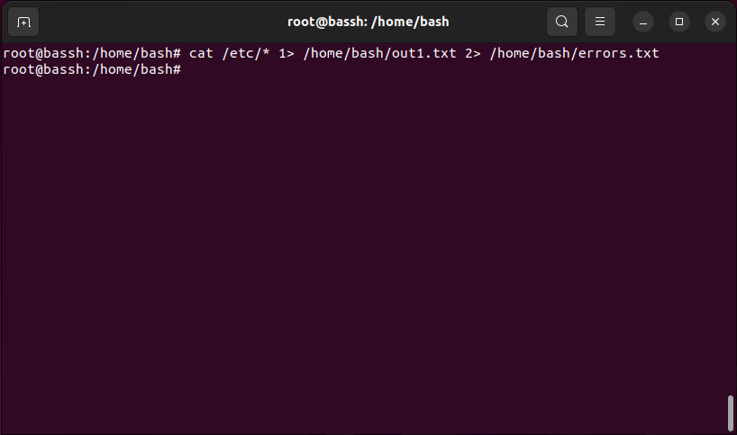
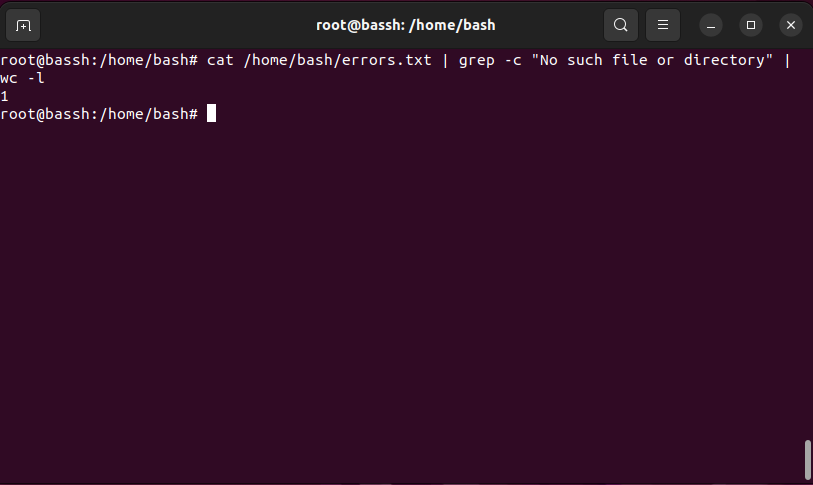
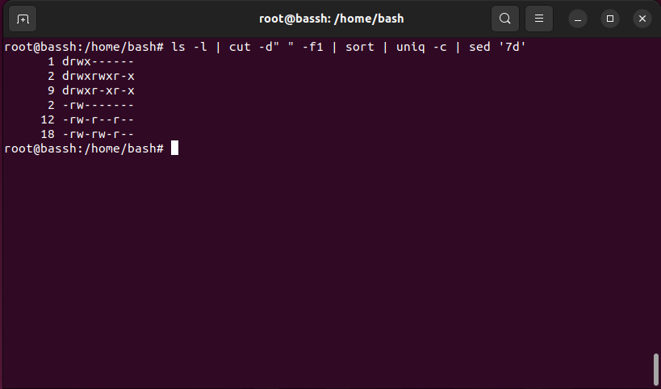
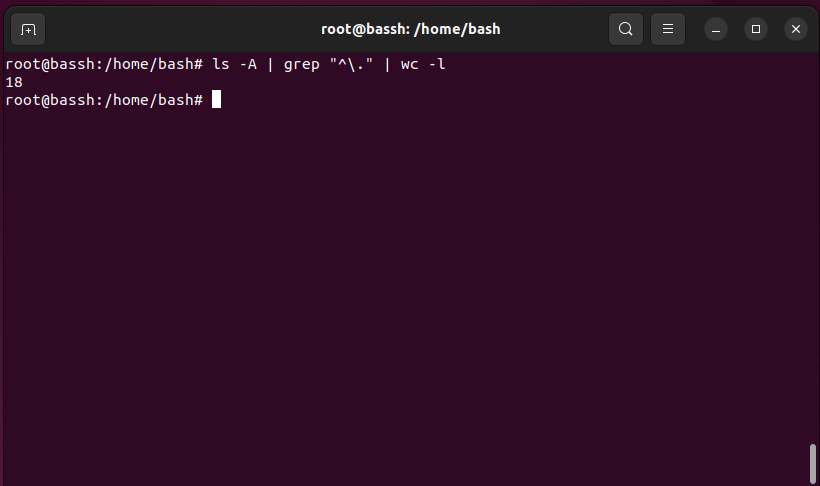

# Домашнее задание к занятию "Работа с текстовыми утилитами"

### [](https://github.com/netology-code/snet-homeworks/blob/snet-18/5-04.md#%D1%86%D0%B5%D0%BB%D1%8C-%D0%B7%D0%B0%D0%B4%D0%B0%D0%BD%D0%B8%D1%8F)Цель задания

В результате выполнения этого задания вы научитесь:

1.  Использовать команды для поиска файлов в Linux;
2.  Перенаправлять потоки в различные файлы;
3.  Подсчитывать количество строк в выводе;
4.  Использовать сортировку.

---

### [](https://github.com/netology-code/snet-homeworks/blob/snet-18/5-04.md#%D1%87%D0%B5%D0%BA%D0%BB%D0%B8%D1%81%D1%82-%D0%B3%D0%BE%D1%82%D0%BE%D0%B2%D0%BD%D0%BE%D1%81%D1%82%D0%B8-%D0%BA-%D0%B4%D0%BE%D0%BC%D0%B0%D1%88%D0%BD%D0%B5%D0%BC%D1%83-%D0%B7%D0%B0%D0%B4%D0%B0%D0%BD%D0%B8%D1%8E)Чеклист готовности к домашнему заданию

1.  Установлена операционная система Ubuntu на виртуальную машину или локально и имеется доступ к терминалу (удаленный или из графической оболочки)
2.  Просмотрены скрипты, рассматриваемые на лекции, которые находятся по [ссылке](https://github.com/netology-code/snet-homeworks/blob/snet-18/5-04)
3.  Установлена утилита mlocate `sudo apt-get install mlocate`

### [](https://github.com/netology-code/snet-homeworks/blob/snet-18/5-04.md#%D0%B8%D0%BD%D1%81%D1%82%D1%80%D1%83%D0%BA%D1%86%D0%B8%D1%8F-%D0%BA-%D0%B7%D0%B0%D0%B4%D0%B0%D0%BD%D0%B8%D1%8E)Инструкция к заданию

1.  Сделайте копию [Шаблона для домашнего задания](https://docs.google.com/document/d/1youKpKm_JrC0UzDyUslIZW2E2bIv5OVlm_TQDvH5Pvs/edit) себе на Google Диск.
2.  В названии файла введите корректное название лекции и вашу фамилию и имя.
3.  Зайдите в “Настройки доступа” и выберите доступ “Просматривать могут все в Интернете, у кого есть ссылка”. Ссылка на инструкцию [Как предоставить доступ к файлам и папкам на Google Диске](https://support.google.com/docs/answer/2494822?hl=ru&co=GENIE.Platform%3DDesktop)
4.  Скопируйте текст задания в свой Google Документ.
5.  Для успешного выполнения задания составьте конвейеры из нескольких команд, приложите команды в текстовом виде и необходимые скриншоты в свой Google Документ.
6.  Для проверки домашнего задания преподавателем отправьте ссылку на ваш Google документ в личном кабинете.
7.  Любые вопросы по решению задач задавайте в чате учебной группы

---

### [](https://github.com/netology-code/snet-homeworks/blob/snet-18/5-04.md#%D0%B7%D0%B0%D0%B4%D0%B0%D0%BD%D0%B8%D0%B5-1)Задание 1.

-   Найдите все файлы с расширением `.conf` в /etc сначала с помощью команды `find`, а потом с помощью команды `locate`;
-   Перенаправьте результаты работы каждой команды в разные файлы;
-   Подсчитайте количество найденных файлов в каждом случае с помощью `wc`.
Ответ:


---

### [](https://github.com/netology-code/snet-homeworks/blob/snet-18/5-04.md#%D0%B7%D0%B0%D0%B4%D0%B0%D0%BD%D0%B8%D0%B5-2)Задание 2.

-   Выведите с помощью `cat` содержимое всех файлов в директории /etc `cat /etc/*`;
-   Направьте ошибки в отдельный файл в вашей домашней директории;
-   Стандартный поток вывода направьте в другой файл;
-   Подсчитайте, сколько объектов не удалось прочитать.
Ответ:


---

### [](https://github.com/netology-code/snet-homeworks/blob/snet-18/5-04.md#%D0%B7%D0%B0%D0%B4%D0%B0%D0%BD%D0%B8%D0%B5-3)Задание 3.

-   Перенаправьте результат работы команды `ls -l` в каталоге с большим количеством файлов в утилиту `cut`, чтобы отобразить только права доступа к файлам;
-   Отправьте в конвейере этот вывод на `sort` и `uniq`, чтобы отфильтровать все повторяющиеся строки;
-   Уберите из подсчета строку `total`;
-   С помощью `wc` подсчитайте различные типы разрешений в этом каталоге.
Ответ:

Простите не понял последний пункт, выполнил через команду  ```uniq -c``` 


---

## [](https://github.com/netology-code/snet-homeworks/blob/snet-18/5-04.md#%D0%B4%D0%BE%D0%BF%D0%BE%D0%BB%D0%BD%D0%B8%D1%82%D0%B5%D0%BB%D1%8C%D0%BD%D1%8B%D0%B5-%D0%B7%D0%B0%D0%B4%D0%B0%D0%BD%D0%B8%D1%8F-%D1%81%D0%BE-%D0%B7%D0%B2%D0%B5%D0%B7%D0%B4%D0%BE%D1%87%D0%BA%D0%BE%D0%B9)Дополнительные задания (со звездочкой*)

Эти задания дополнительные (не обязательные к выполнению) и никак не повлияют на получение вами зачета по этому домашнему заданию. Вы можете их выполнить, если хотите глубже и/или шире разобраться в материале.

### [](https://github.com/netology-code/snet-homeworks/blob/snet-18/5-04.md#%D0%B7%D0%B0%D0%B4%D0%B0%D0%BD%D0%B8%D0%B5-4)Задание 4.

В ОС Linux скрытыми файлами считаются те, имена которых начинаются с точки.

Сколько скрытых файлов в вашем домашнем каталоге?
Ответ: 


---

### [](https://github.com/netology-code/snet-homeworks/blob/snet-18/5-04.md#%D0%BF%D1%80%D0%B0%D0%B2%D0%B8%D0%BB%D0%B0-%D0%BF%D1%80%D0%B8%D0%B5%D0%BC%D0%B0-%D1%80%D0%B0%D0%B1%D0%BE%D1%82%D1%8B)Правила приема работы

-   В личном кабинете отправлена ссылка на ваш Google Документ, в котором прописаны команды в текстовом виде и скриншоты, демонстрирующий работу каждой команды
-   В документе настроены права доступа “Просматривать могут все в Интернете, у кого есть ссылка”
-   Название документа содержит название лекции и ваши фамилию и имя

---

### [](https://github.com/netology-code/snet-homeworks/blob/snet-18/5-04.md#%D0%BA%D1%80%D0%B8%D1%82%D0%B5%D1%80%D0%B8%D0%B8-%D0%BE%D1%86%D0%B5%D0%BD%D0%BA%D0%B8)Критерии оценки

Зачет - выполнены все задания, приложен текст команды, приложены соответствующие скриншоты, в выполненных заданиях нет противоречий и нарушения логики

На доработку - задание выполнено частично или не выполнено, в логике выполнения заданий есть противоречия, команды не работают или работают не во всех случаях.