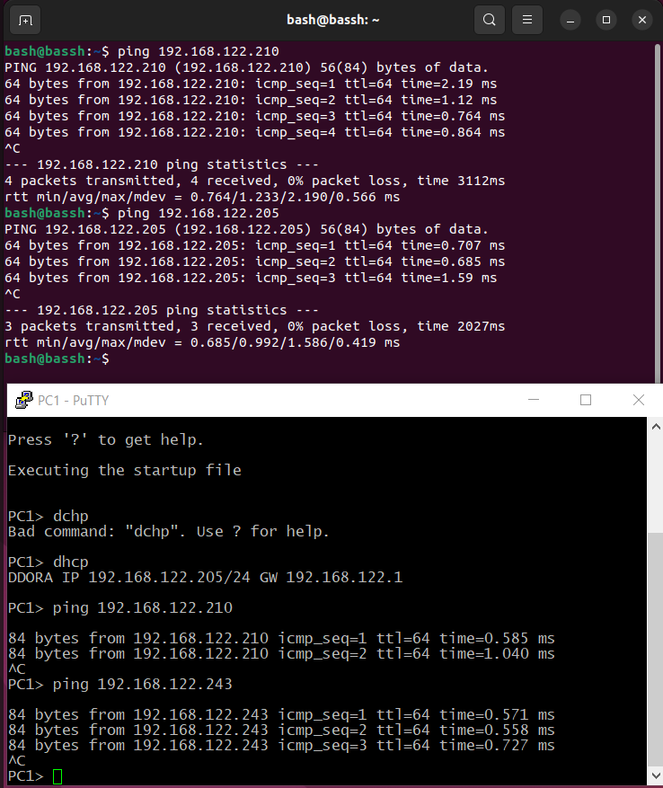

# Домашнее задание к занятию «Типы виртуализации: KVM, QEMU»

### Оформление домашнего задания

1.  Домашнее задание выполните в [Google Docs](https://docs.google.com/) и отправьте на проверку ссылку на ваш документ в личном кабинете.
2.  В названии файла укажите номер лекции и фамилию студента. Пример названия: 6.2. Типы виртуализаций: KVM, QEMU — Александр Александров.
3.  Перед отправкой проверьте, что доступ для просмотра открыт всем, у кого есть ссылка. Если нужно прикрепить дополнительные ссылки, добавьте их в свой Google Docs.

Любые вопросы по решению задач задавайте в чате учебной группы.

---

## Важно

Перед отправкой работы на проверку удаляйте неиспользуемые ресурсы. Это нужно, чтобы предупредить неконтролируемый расход средств, полученных после использования промокода.

Рекомендации [по ссылке](https://github.com/netology-code/sdvps-homeworks/tree/main/recommend).

---

### Задание 1

**Ответьте на вопрос в свободной форме.**

Какие виртуализации существуют? Приведите примеры продуктов разных типов виртуализации.

Ответ: Существуют аппаратная виртуализация и програмная.  
Аппаратная виртуализация работает благодаря поддержке со стороны железа: процессора. Гостевые ОС управляются гипервизором  
напрямую, без участия хостовой ОС. (VT-x, AMD-V)

Программная виртуализация эмулирует все железо от  
процессора до сетевого адаптера (если он нужен).(QEMU, VirtualBox) 

---

### Задание 2

Выполните действия и приложите скриншоты по каждому этапу:

1.  Установите QEMU в зависимости от системы (в лекции рассматривались примеры).
2.  Создайте виртуальную машину.
3.  Установите виртуальную машину. Можете использовать пример [по ссылке](https://dl-cdn.alpinelinux.org/alpine/v3.13/releases/x86/alpine-standard-3.13.5-x86.iso).

Пример взят [с сайта](https://alpinelinux.org/).

Ответ:

---

### Задание 3

Выполните действия и приложите скриншоты по каждому этапу:

1.  Установите KVM и библиотеку libvirt. Можете использовать GUI-версию из лекции.
2.  Создайте виртуальную машину.
3.  Установите виртуальную машину. Можете использовать пример [по ссылке](https://dl-cdn.alpinelinux.org/alpine/v3.13/releases/x86/alpine-standard-3.13.5-x86.iso).

Пример взят [с сайта](https://alpinelinux.org/).

Ответ: 

---

### Задание 4

Выполните действия и приложите скриншоты по каждому этапу:

1.  Создайте проект в GNS3, предварительно установив [GNS3](https://github.com/GNS3/gns3-gui/releases).
2.  Создайте топологию, как на скрине ниже.
3.  Для реализации используйте машину на базе QEMU. Можно дублировать, сделанную ранее.

Ответ: 

---

## Дополнительные задания* (со звёздочкой)

Их выполнение необязательное и не влияет на получение зачёта по домашнему заданию. Можете их решить, если хотите лучше разобраться в материале.

---

### Задание 5*

1.  Установите виртуальные (alpine) машины двух различных архитектур, отличных от X86 в QEMU.
2.  Приложите скриншоты действий.

---

### Задание 6*

1.  Установите виртуальные (alpine) машины двух различных архитектур, отличных от X86 в KVM.
2.  Приложите скриншоты действий.
