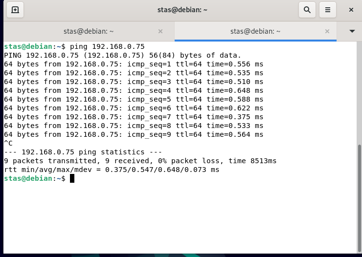

# Домашнее задание к занятию "4.8. Траблшутинг"

**

**Домашнее задание выполните в [Google Docs](https://docs.google.com/) и отправьте в личном кабинете на проверку ссылку на ваш документ.**

Название файла должно содержать номер лекции и фамилию студента. Пример названия: "4.8. Траблшутинг - Александр Александров"

Перед тем как выслать ссылку, убедитесь, что ее содержимое не является приватным (открыто на просмотр всем, у кого есть ссылка). Если необходимо прикрепить дополнительные ссылки, просто добавьте их в свой Google Docs.

Любые вопросы по решению задач задавайте в чате учебной группы.

---

### Задание 1.

1.  Укажите путь к файлам логов веб-сервера `Nginx`.
2.  Где находится конфигурационный файл, в котором можно посмотреть / поменять эти пути?
3.  Какой командой можно воспользоваться для просмотра файла журнала в режиме реального времени? Попробуйте найти сами, либо воспользуйтесь [ссылкой](https://andreyex.ru/operacionnaya-sistema-linux/nastrojka-zhurnala-oshibok-i-dostupa-nginx/).

_Приведите ответ в свободной форме._

Ответ: 
1. `/var/log/nginx/`
2. `/etc/nginx/nginx.conf`
3. `tail -f <log-file>`
---

### Задание 2.

Познакомьтесь со схемой сети.

1.  `COMP1` не может обменяться данными с `COMP4`. Какую последовательность действий вы выберете для того, чтобы локализовать проблему?
2.  Возможно ли, чтобы при выполнении `ping 192.168.1.2` с компьютера `COMP5`, `ping` прошёл, а подключение по HTTP с `COMP5` на `COMP1` не проходило бы? Поясните свой ответ максимально детально.
3.  `COMP5` отправляет `ping` на `COMP1` и `COMP2`, при этом `COMP1` на `ping` отвечает, а `COMP2` - нет.

Приведите максимальное количество причин. Самую простую, но нередко встречающуюся - «У `COMP2` выдернули кабель питания» - я уже ответил за вас.

4.  `COMP1` пингует только адреса из подсети `192.168.1.0/24` (`COMP2` и `192.168.1.1`), больше никакие адреса не пингуются. С чем это может быть связано?

_Приведите ответ в свободной форме._

Ответ:
1. Запущу trace что бы понять где прерывается соединение, дальше всё зависит от места обрыва.
2. Возможно проблема с портом; либо отрабатывает firewall; сервис работает через другой порт; проблема в работе ПО.
3. Неправильные настроики сети СОМР2; Проблема порта коммутатора.
4. Не прописаны маршруты на маршрутизаторе; на COMP1 не указан  шлюз по умолчанию.

---

**

## Дополнительные задания (со звездочкой*)

Эти задания дополнительные (не обязательные к выполнению) и никак не повлияют на получение вами зачета по этому домашнему заданию. Вы можете их выполнить, если хотите глубже и/или шире разобраться в материале.

### Задание 3.

Используя схему из Задания 2, попробуйте ответить на вопросы:

1.  `COMP1` и `COMP2` оба пингуют `10.1.1.2`, однако не пингуют `192.168.2.1` и прочие адреса из `192.168.2.0/24`. Как вы думаете, что не так и как это можно исправить?
2.  Какими способами мы можем сделать так, чтобы `COMP2` не смог общаться ни с кем кроме своей локальной сети? (Приведите вариант с настройками самого `COMP2` и попробуйте придумать, можно ли что-то сделать на маршрутизаторе `192.168.1.1`)
3.  Как вы думаете, что будет происходить при попытке провести `ping` с `COMP5` на `192.168.2.3` ?

_Приведите ответ в свободной форме._

Ответ:
1.  Маршрутизатор `10.1.1.1` не знает о сети `192.168.2.0/24` ,исправить можно, например, прописав статические маршруты.
2. Не указывать на СОМР2 маршрут по умолчанию. На маршрутезаторе в ACL не маршрутизировать сеть, не знаю можно ли прописывать отдельный хост, но думаю что можно.
3.  Думаю что на `ping` ответит хост до которого запрос дойдет быстрее, точнее кто быстрее ответит на ARP от коммутатора.

---

### Задание 4.

-   Сделайте `ping` с одной виртуальной / физической машины на другую.
-   Используя [описание утилиты iperf](https://losst.ru/kak-polzovatsya-iperf), загрузите канал между двумя виртуальными машинами на максимум, например, на 60 секунд, в процессе загрузки повторите `ping`.
-   Изменились ли цифры в ответе команды `ping`? Почему? Есть ли разница между физическими и виртуальными машинами?

_Приведите скриншоты/ответы команд до и во время высокой загрузки каналов._

Ответ:  пинг без нагрузки vm на vm

пинг без нагрузки с физической на vm:
Пинг с VM на VM  под нагрузкой: 
Пинг с физической на VM под нагрузкой:Нагрузка была организованна с одной виртуальной машины на другую, в результате пинг с vm на vm увеличился в несколько раз, но при этом пинг с физической машины на vm не изменился. 
