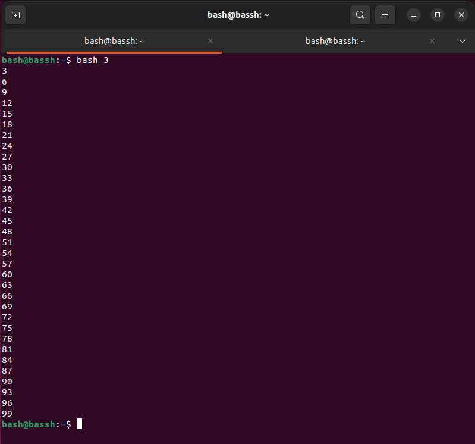
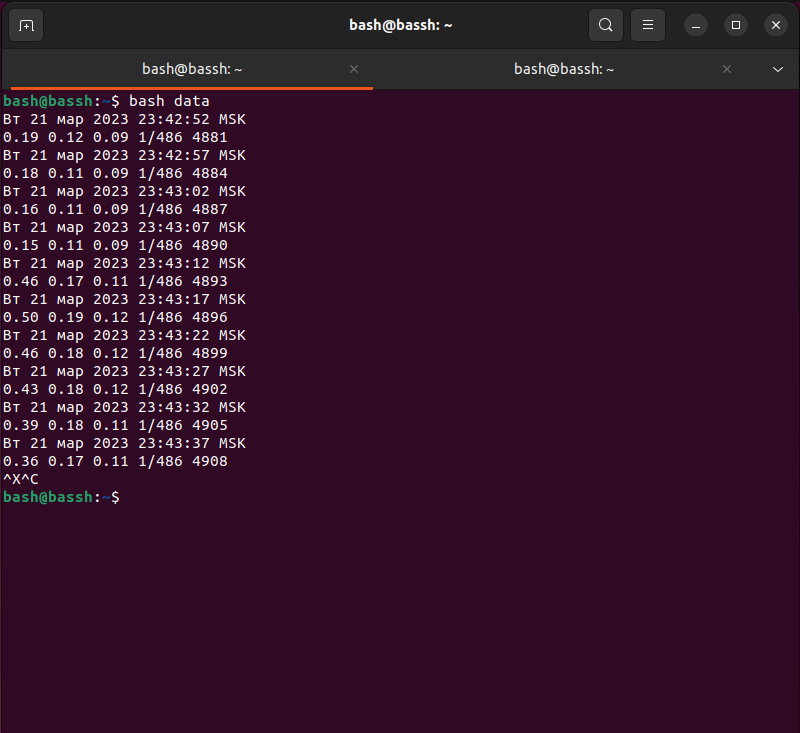
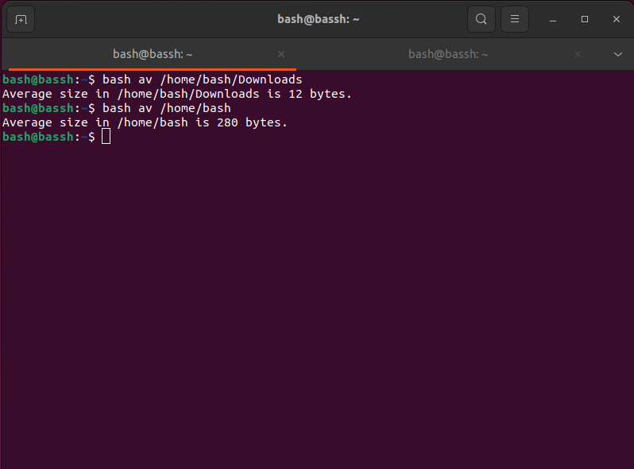
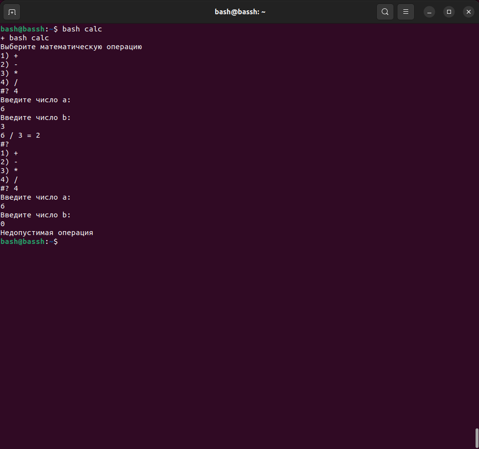

# Домашнее задание к занятию "Циклы и функции."

### [](https://github.com/netology-code/snet-homeworks/blob/snet-18/5-02.md#%D1%86%D0%B5%D0%BB%D1%8C-%D0%B7%D0%B0%D0%B4%D0%B0%D0%BD%D0%B8%D1%8F)Цель задания

В результате выполнения этого задания вы научитесь:

1.  Использовать на практике циклы и функции в bash;
2.  Использовать команду, которая позволяет "засыпать" скрипту на определенное время;
3.  Обрабатывать большое количество файлов внутри bash-скриптов;
4.  Работать с числовыми данными в своих скриптах.

---

### [](https://github.com/netology-code/snet-homeworks/blob/snet-18/5-02.md#%D1%87%D0%B5%D0%BA%D0%BB%D0%B8%D1%81%D1%82-%D0%B3%D0%BE%D1%82%D0%BE%D0%B2%D0%BD%D0%BE%D1%81%D1%82%D0%B8-%D0%BA-%D0%B4%D0%BE%D0%BC%D0%B0%D1%88%D0%BD%D0%B5%D0%BC%D1%83-%D0%B7%D0%B0%D0%B4%D0%B0%D0%BD%D0%B8%D1%8E)Чеклист готовности к домашнему заданию

1.  Установлена операционная система Ubuntu на виртуальную машину или локально и имеется доступ к терминалу (удаленный или из графической оболочки)
2.  Просмотрены скрипты, рассматриваемые на лекции, которые находятся по [ссылке](https://github.com/netology-code/snet-homeworks/blob/snet-18/5-02)

---

### [](https://github.com/netology-code/snet-homeworks/blob/snet-18/5-02.md#%D0%B8%D0%BD%D1%81%D1%82%D1%80%D1%83%D0%BA%D1%86%D0%B8%D1%8F-%D0%BA-%D0%B7%D0%B0%D0%B4%D0%B0%D0%BD%D0%B8%D1%8E)Инструкция к заданию

1.  Для успешного выполнения задания необходимо написать три bash скрипта.
2.  На проверку необходимо направить код каждого скрипта и скриншот, демонстрирующий различные сценарии работы данного скрипта.

---

### [](https://github.com/netology-code/snet-homeworks/blob/snet-18/5-02.md#%D0%B7%D0%B0%D0%B4%D0%B0%D0%BD%D0%B8%D0%B5-1)Задание 1.

Напишите скрипт.

Скрипт должен выводить на экран все числа от 1 до 100, которые делятся на 3.

Для выполнения задания используйте цикл.

Ответ:
```                                   
i=3

while [[ $i -le 99 ]]; do

  echo $i

  i=$(($i + 3))

done;


```

---

### [](https://github.com/netology-code/snet-homeworks/blob/snet-18/5-02.md#%D0%B7%D0%B0%D0%B4%D0%B0%D0%BD%D0%B8%D0%B5-2)Задание 2.

Напишите скрипт, который каждые 5 секунд будет выводить на экран текущее время и содержимое файла `/proc/loadavg`.

Для выполнения задания используйте цикл.

Ответ:
```
while true; do

  date
  
  cat /proc/loadavg
  
  sleep 5
  
done
```

---

### [](https://github.com/netology-code/snet-homeworks/blob/snet-18/5-02.md#%D0%B7%D0%B0%D0%B4%D0%B0%D0%BD%D0%B8%D0%B5-3)Задание 3.

Напишите функцию для подсчета среднего размера файла в директории.

-   путь к директории должен передаваться параметром, например `avgfile /home/username`;
-   функция должна проверять, что такая директория существует, подсчитывать и выводить на экран средний размер файла в ней;
-   при подсчете не нужно учитывать поддиректории и символьные ссылки, считать только средний размер файлов в заданной директории.
-   для вывода среднего достаточно использовать целочисленное значение (стандартное деление в bash)


Ответ:
```
#! /bin/bash

avgfile () {

directory=$1

if [ -d $directory ]; then
# почему то скрипт считал файлы только в той директиории в которой он был размещен поэтому я добавил комманду cd, интересно почему так получается?
  cd $directory 

else

  echo "$1 is not a directory."

  exit 1

fi

total_size=0

file_count=0

for file in $directory/ *; do

 if [ -f "$file" ]; then

  size=$(stat -c%s "$file")

  total_size=$((total_size + size))

  file_count=$((file_count + 1))

 fi 

done

if [ $file_count -eq 0 ]; then

  echo "No files found in $1"

  exit 1

fi

average_size=$((total_size / file_count))

echo "Average size in $directory is $average_size bytes." 

}

avgfile $1 
```

---

## [](https://github.com/netology-code/snet-homeworks/blob/snet-18/5-02.md#%D0%B4%D0%BE%D0%BF%D0%BE%D0%BB%D0%BD%D0%B8%D1%82%D0%B5%D0%BB%D1%8C%D0%BD%D1%8B%D0%B5-%D0%B7%D0%B0%D0%B4%D0%B0%D0%BD%D0%B8%D1%8F-%D1%81%D0%BE-%D0%B7%D0%B2%D0%B5%D0%B7%D0%B4%D0%BE%D1%87%D0%BA%D0%BE%D0%B9)Дополнительные задания (со звездочкой*)

Эти задания дополнительные (не обязательные к выполнению) и никак не повлияют на получение вами зачета по этому домашнему заданию. Вы можете их выполнить, если хотите глубже и/или шире разобраться в материале.

### [](https://github.com/netology-code/snet-homeworks/blob/snet-18/5-02.md#%D0%B7%D0%B0%D0%B4%D0%B0%D0%BD%D0%B8%D0%B5-4)Задание 4.

Напишите свой калькулятор.

В нем реализуйте простейшие арифметические операции: «+»; «-»; «*»; «/».

Считывание параметров реализуйте с помощью `read` и `select`.

1.  Сначала пользователю требуется выбрать математическую операцию через select
2.  Затем пользователю предлагается ввести два числа через команду read.
3.  Производится проверка вводимых чисел, что они являются числами
4.  Производится требуемая математическая операция и выводится результат или ошибка.
5.  При желании, можно реализовать деление чисел с плавающей запятой

Ответ: 
```


echo "Выберите математическую операцию"

select op in + - \* \/; do

echo "Введите число a:"
 read a
echo "Введите число b:"
 read b

if [ $a -re ]
case $op in
\/)
if [ "$b" -eq 0 ]; then
 echo "Недопустимая операция"
 exit 1
else
 let c=$a/$b
fi;

;;

\*)
let c=$a*$b
;;

\+)
let c=$a+$b
;;

\-)
let c=$a-$b
;;
esac

 echo "$a $op $b = $c"

done


```
Не понял как делать проверку на число, если можете, подскажите пожалуйста))




_Примечание:_ постарайтесь максимально защититься от ошибок, т.к. пользователи любят написать строку вместо числа.

---

### [](https://github.com/netology-code/snet-homeworks/blob/snet-18/5-02.md#%D0%BF%D1%80%D0%B0%D0%B2%D0%B8%D0%BB%D0%B0-%D0%BF%D1%80%D0%B8%D0%B5%D0%BC%D0%B0-%D1%80%D0%B0%D0%B1%D0%BE%D1%82%D1%8B)Правила приема работы

Домашнее задание выполните в Google Docs и отправьте в личном кабинете на проверку ссылку на ваш документ.

Название файла должно содержать название лекции и фамилию студента. Пример названия: "Программирование на Bash : Циклы и функции - Иван Иванов"

Перед тем как выслать ссылку, убедитесь, что ее содержимое не является приватным (открыто на просмотр всем, у кого есть ссылка).

В файле должен присутствовать номер задания, текст задания, код скрипта и скриншоты, демонстрирующие корректную работу скрипта.

Любые вопросы по решению задач задавайте в чате учебной группы в Discord.

---

### [](https://github.com/netology-code/snet-homeworks/blob/snet-18/5-02.md#%D0%BA%D1%80%D0%B8%D1%82%D0%B5%D1%80%D0%B8%D0%B8-%D0%BE%D1%86%D0%B5%D0%BD%D0%BA%D0%B8)Критерии оценки

Зачет - выполнены все задания, приложен скрипт, приложены соответствующие скриншоты, в выполненных заданиях нет противоречий и нарушения логики

На доработку - задание выполнено частично или не выполнено, в логике выполнения заданий есть противоречия, скрипты не работают или работают не во всех случаях.